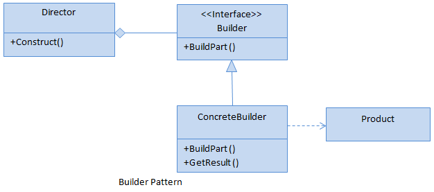
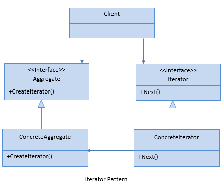

<div style="display: inline-block;">
<a class="link" href="http://oclipa.github.io/">&lt; home</a>
<a class="link" href="http://oclipa.github.io/toolbox.html">&lt; toolbox</a>
</div> 

## C# (work-in-progress)

&nbsp;

<button type="button" id="toggle-all" value="none">Expand All Sections</button>

&nbsp;
<hr/>

<!-- =========================#####################################################================================ -->
<div id="stupid">
<button type="button" class="collapsible">+ Stupid, Simple Stuff I Keep Forgetting</button>
<div class="content" style="display: none;" markdown="1">

<!-- =========================#####################################################================================ -->
<div id="stupid-class">
<button type="button" class="collapsible">+ Class Syntax</button>
<div class="content" style="display: none;" markdown="1">

```cs
using System;

namespace MyNamespace
{
    public abstract class MySuperClass
    {
        public MySuperClass()
        {
        }

        public abstract void Output();
    }

    public class MySubClass : MySuperClass
    {
        private int val;

        public MySubClass(int val = 5)
        {
            this.val = val;
        }

        public override void Output()
        {
            Console.WriteLine($"{this.val}");
        }
    }

    class Program
    {
        static void Main(string[] args)
        {
            MySuperClass myClass = new MySubClass();

            myClass.Output(); // output 5

            myClass = new MySubClass(10);

            myClass.Output(); // output 10
        }
    }
}
```

</div>
</div>

<!-- =========================#####################################################================================ -->
<div id="stupid-struct">
<button type="button" class="collapsible">+ Struct Syntax</button>
<div class="content" style="display: none;" markdown="1">

```cs
using System;

namespace MyNamespace
{
    public struct MyStruct1
    {
        public int x;
        public int y;
    }
    
    public struct MyStruct2
    {
        public MyStruct2(int x, int y)
        {
            this.x = x;
            this.y = y;
        }
        
        public int x;
        public int y;
    }
    
    class Program
    {
        static void Main(string[] args)
        {
            MyStruct1 myStruct1 = new MyStruct1();
            myStruct1.x = 5;
            myStruct1.y = 6;
            
            Console.WriteLine($"{myStruct1.x}, {myStruct1.y}"); // output: 5, 6
            
            MyStruct2 myStruct2 = new MyStruct2(7, 8);
            
            Console.WriteLine($"{myStruct2.x}, {myStruct2.y}"); // output: 7, 8
        }
    }
}
```

</div>
</div>

<!-- =========================#####################################################================================ -->
<div id="stupid-enum">
<button type="button" class="collapsible">+ Enum Syntax</button>
<div class="content" style="display: none;" markdown="1">

```cs
using System;

namespace MyNamespace
{
    enum MyEnum
    {
        Val1,     // 0
        Val2,     // 1
        Val3 = 6, // 6
        Val4,     // 7
        Val5,     // 8
        Val6      // 9
    }

    class Program
    {
        static void Main(string[] args)
        {
            Console.WriteLine(MyEnum.Val2); // output: Val2 
            int val = (int)MyEnum.Val2; // enum to int conversion
            Console.WriteLine(val); // output: 1 

            var en = (MyEnum)8; // int to enum conversion
            Console.WriteLine(en); // output: Val5 
        }
    }
}
```

</div>
</div>

<!-- =========================#####################################################================================ -->
<div id="stupid-switch">
<button type="button" class="collapsible">+ Switch Syntax</button>
<div class="content" style="display: none;" markdown="1">

```cs
using System;

namespace MyNamespace
{
    class Program
    {
        static void Main(string[] args)
        {
            int x = 10;

            switch (x)
            { 
                case 5:
                    Console.WriteLine("Value of x is 5");
                    break;
                case 10:
                    Console.WriteLine("Value of x is 10");
                    break;
                case 15:
                    Console.WriteLine("Value of x is 15");
                    break;
                default:
                    Console.WriteLine("Unknown value");
                    break;
            }
        }
    }
}
```

</div>
</div>

<!-- =========================#####################################################================================ -->
<div id="stupid-switch">
<button type="button" class="collapsible">+ Event Syntax</button>
<div class="content" style="display: none;" markdown="1">

```cs
using System;

namespace MyNamespace
{
    public class MyClass
    {
        public MyClass()
        {
        }

        public void TriggerEvent()
        {
            Changed(10);
        }

        public event Action<int> Changed;
    }

    class Program
    {
        static void Main(string[] args)
        {
            MyClass myClass = new MyClass();

            myClass.Changed += ChangeHandler;

            myClass.TriggerEvent(); // output: 10
        }

        static void ChangeHandler(int val)
        {
            Console.WriteLine($"{val}");
        }
    }
}
```

</div>
</div>

<!-- =========================#####################################################================================ -->
<div id="stupid-strings">
<button type="button" class="collapsible">+ Displaying Strings</button>
<div class="content" style="display: none;" markdown="1">

String Formatter:

```cs
Console.WriteLine(string.Format("{0} & {1}", var1, var2));
```

String Interpolation:

```cs
Console.WriteLine($"{var1} & {var2}");
```
</div>
</div>

<!-- =========================#####################################################================================ -->
<div id="stupid-strings">
<button type="button" class="collapsible">+ Serialize to JSON</button>
<div class="content" style="display: none;" markdown="1">

```cs
using System;
using System.Text.Json;

public class Car
{
    public string Model
    {
        get { return "Volkswagon"; }
    }

    public string Make
    {
        get { return "Golf"; }
    }

    public CarDetails Details
    {
        get { return new CarDetails(); }
    }
}

public class CarDetails
{
    public int Year
    {
        get { return 2017; }
    }

    public float Price
    {
        get { return 20000f; }
    }

    public Condition Condition
    {
        get { return Condition.EXCELLENT; }
    }
}

public enum Condition
{
    EXCELLENT,
    GOOD,
    POOR
}

class Program
{
    static void Main()
    {
        Car car = new Car();
        var options = new JsonSerializerOptions { WriteIndented = true };
        Console.WriteLine(JsonSerializer.Serialize(car, typeof(Car), options));
        
        // Output:
        // {
        //     "Model": "Volkswagon",
        //     "Make": "Golf",
        //     "Details": {
        //         "Year": 2017,
        //         "Price": 20000,
        //         "Condition": 0
        //      }
        // }
    }
}
```
</div>
</div>

</div>
</div>

<hr/>

<!-- =========================#####################################################================================ -->
<div id="theory">
<button type="button" class="collapsible">+ Theory</button>
<div class="content" style="display: none;" markdown="1">
    
<!-- =========================#####################################################================================ -->
<div id="intro">
<button type="button" class="collapsible">+ What is C#?
<code class="ex">
C# is an object-oriented, type-safe, and managed language that is compiled by .NET Framework to generate Microsoft Intermediate Language.
</code>
</button>
<div class="content" style="display: none;" markdown="1">
    
</div>
</div>

<!-- =========================#####################################################================================ -->
<div id="memory">
<button type="button" class="collapsible">+ Stack vs Heap
<code class="ex">
Stack: contiguous memory; consists of frames, each of which corresponds to a method; frames are pushed to the stack, or popped from the stack (hence "call-stack")

Heap: dynamic memory; objects are garbage collected on occasion.
</code>
</button>
<div class="content" style="display: none;" markdown="1">

### Stack:
  * Contiguous memory.
  * A stack consists of frames; each frame corresponds to a method/function call.  A pointer references the current frame.
  * When a method is called, all of its value-types (and pointers) are stored as a frame which is pushed onto the top of the stack.
  * When the method returns, the frame for that method is popped off the stack (releasing the memory) and the pointer moves down to the next frame (i.e. the calling method).

### Heap:
   * Dynamic memory which can be allocated at will.
   * Can be fragmented since no guarantee which memory will be available at time objects are written.
   * Creating a reference-type objects reserves memory for the objects, plus overhead for the pointer, plus overhead for memory management.
   * When a reference-type objects is no longer referenced from the stack (or another objects), it is available to be garbage collected (which happens on occasion).


</div>
</div>

<!-- =========================#####################################################================================ -->
<div id="interview-encapsulation"> 
  <button type="button" class="collapsible">+ Encapsulation<br/>
<code class="ex">
data + behaviour = class
</code>
  </button>   
<div class="content" style="display: none;" markdown="1">

As the name suggestions, Encapsulation is the combination of an objects data and behaviours in a single unit, e.g. a Class.

The benefits of encapsulation are:
1. protection of data
1. control of accessibility
1. reduction of complexity (allows extensibility)
1. improved maintainability (reduces coupling between objects)

</div>
</div>

<!-- =========================#####################################################================================ -->
<div id="interview-inheritance"> 
  <button type="button" class="collapsible">+ Inheritance<br/>
<code class="ex">
Inheritance is the ability for multiple derived classes with similar features to be treated as objects of a common base class (or interface). 

To prevent inheritance of a class, use 'sealed class'.

To stop inheritance of a virtual or abstract member, use 'sealed override myMember'.
</code>
  </button>   
<div class="content" style="display: none;" markdown="1">

```cs
using System;

namespace Sandbox
{
    public class Car
    {
        public int Wheels { get { return 4; } }
    }

    public class Audi : Car { }
    public class BMW : Car { }

    class Program
    {
        static void Main(string[] args)
        {
            Car myAudi = new Audi();
            Car myBmw = new BMW();

            Console.WriteLine(myAudi.Wheels); // 4
            Console.WriteLine(myBmw.Wheels); // 4
        }
    }
}
```
  
</div>
</div>

<!-- =========================#####################################################================================ -->
<div id="interview-polymorphism"> 
  <button type="button" class="collapsible">+ Polymorphism<br/>
<code class="ex">
Polymorphism is the ability for derived classes to override properties of a common base class.

Static = Overloading

Dynamic = Interfaces, Abstract Classes, Virtual Members
   </code>
  </button>   
<div class="content" style="display: none;" markdown="1">

```cs
using System;

namespace Sandbox
{
    public interface IVehicle
    {
        int Wheels { get; }
    }

    public class Car : IVehicle
    {
        public int Wheels { get { return 4; } }
    }

    public class Bike : IVehicle
    {
        public int Wheels { get { return 2; } }
    }

    class Program
    {
        static void Main(string[] args)
        {
            IVehicle myCar = new Car();
            IVehicle myBike = new Bike();

            Console.WriteLine(myCar.Wheels); // 4
            Console.WriteLine(myBike.Wheels); // 2
        }
    }
}
```

</div>
</div>

<!-- =========================#####################################################================================ -->
<div id="interview-abstraction"> 
  <button type="button" class="collapsible">+ Abstraction<br/>
<code class="ex">
Abstraction hiding internal implementation details by making a class/interface as 'abstract' as possible.
</code>
  </button>   
<div class="content" style="display: none;" markdown="1">

```cs
using System;

namespace Sandbox
{
    public interface IVehicle
    {
        void Start();
    }

    public class Car : IVehicle
    {
        public void Start() { startEngine(); }
        private void startEngine()
        {
            Console.WriteLine("Brrm brrm");
        }
    }

    public class Bike : IVehicle
    {
        public void Start() { startPeddling(); }
        private void startPeddling()
        {
            Console.WriteLine("Puff puff");
        }
    }

    class Program
    {
        static void Main(string[] args)
        {
            IVehicle myCar = new Car();
            IVehicle myBike = new Bike();

            myCar.Start(); // Brrm Brrm
            myBike.Start(); // Puff puff
        }
    }
}
```
</div>
</div>

<!-- =========================#####################################################================================ -->
<div id="interview-classvsobj"> 
  <button type="button" class="collapsible">+ Class vs Object<br/>
<code class="ex">
Class = Definition of an object.
        
Object = Instantiation of an class.
</code>
  </button>   
<div class="content" style="display: none;" markdown="1">

</div>
</div>

<!-- =========================#####################################################================================ -->
<div id="interview-kiss"> 
  <button type="button" class="collapsible">+ KISS: Keep It Simple Stupid<br/>
<code class="ex">
Simple names and simple implementations are better than complex or obscure ones.
</code>
  </button>   
<div class="content" style="display: none;" markdown="1">

</div>
</div>

<!-- =========================#####################################################================================ -->
<div id="interview-dry"> 
  <button type="button" class="collapsible">+ DRY: Don't Repeat Yourself<br/>
<code class="ex">
Code in small pieces, and reuse the pieces.
</code>
  </button>   
<div class="content" style="display: none;" markdown="1">

</div>
</div>

<!-- =========================#####################################################================================ -->
<div id="interview-yagni"> 
  <button type="button" class="collapsible">+ YAGNI: You Ain't Gonna Need It<br/>
<code class="ex">
Don't include features "just in case".
</code>
  </button>   
<div class="content" style="display: none;" markdown="1">

</div>
</div>

<!-- =========================#####################################################================================ -->
<div id="interview-tda"> 
  <button type="button" class="collapsible">+ TDA: Tell Don't Ask<br/>
<code class="ex">
Don't test an object's state and then make decisions about the methods to call.

Tell the object what you want to do and assume that it knows enough about its internal state to make the right decision.
</code>
  </button>   
<div class="content" style="display: none;" markdown="1">

</div>
</div>

<!-- =========================#####################################################================================ -->
<div id="interview-solid"> 
  <button type="button" class="collapsible">+ SOLID Principles<br/>
 <code class="ex">
SRP: Single Responsibility Principle
OCP: Open-Close Principle
LSP: Liskov Substitution Principle
ISP: Interface Segregation Principle
DIP: Dependency Inversion Principle
</code>
  </button>   
<div class="content" style="display: none;" markdown="1">

These are described in greater detail further down, however in summary:

**SRP: Single Responsibility Principle**

A class should have only one reason to change (one responsibility per class).

**OCP: Open-Close Principle**

Objects should be open for extension, but closed for modification (easy to extend implementation, but cannot be change base implementation).

**LSP: Liskov Substitution Principle**

Every sub-class should be substitutable for its super-class (a client should not need to know whether it is dealing with a sub-class or a super-class).

**ISP: Interface Segregation Principle**

A client should not be forced to depend on methods it does not use (a sub-class should not be forced to implement methods it does not use).

**DIP: Dependency Inversion Principle**

Entities must depend on abstractions not on concretions (a high level module should not depend on a low level module; they should both depend on abstractions).

</div>
</div>

<!-- =========================#####################################################================================ -->
<div id="srp">    
<button type="button" class="collapsible">+ SRP: Single Responsibility Principle
<code class="ex">
A class or function should have only one reason to change.

One responsibility per class/function, where "responsibility" means "a reason to change".

The responsibility should be entirely encapsulated by the class/function.
</code>
</button>    
<div class="content" style="display: none;" markdown="1">

As an example, consider a module that compiles and prints a report. Imagine such a module can be changed for two reasons:
1. The content of the report could change.
1. The format of the report could change. 

These two things change for very different causes; one substantive, and one cosmetic. 

The Single Responsibility Principle says that these two aspects of the problem are really two separate responsibilities, and should, therefore, be in separate classes or modules. 

It would be a bad design to couple two things that change for different reasons at different times.

The reason it is important to keep a class focused on a single concern is that it makes the class more robust. Continuing with the foregoing example, if there is a change to the report compilation process (i.e. the content), there is a greater danger that the printing (i.e. formatting) code will break if it is part of the same class.

An example of code that violates SRP is the following:

```cs
using System;
using System.Collections.Generic;
using System.Linq;

public struct ValidatedOrder
{
    public ValidatedOrder(int customerId, int orderId, List<string> items, float price)
    {
        this.CustomerId = customerId;
        this.Id = orderId;
        this.Items = items;
        this.Price = price;
    }

    public int CustomerId;
    public int Id;
    public List<string> Items;
    public float Price;
}

public class OrderManager
{
    private List<ValidatedOrder> orderCollection = new List<ValidatedOrder>();

    public ValidatedOrder ValidateOrder(int customerId, int id)
    {
        //Code for validation 
        float price = 23.76f;        
        return new ValidatedOrder(customerId, id, new List<string>(), price);
    }

    public bool SaveOrder(ValidatedOrder order)
    {
        //Code for saving order 
        orderCollection.Add(order);
        return true;
    }

    public void NotifyCustomer(int customerId)
    {
        //Code for notification     
    }

    public float SumOfAllCustomerOrders(int customerId)
    {
        //query orders    
        var orders = this.orderCollection.Where(c => c.CustomerId == customerId);
        
        // sum orders
        float sum = 0;
        foreach (ValidatedOrder order in orders)
        {
            sum += order.Price;
        }
        return sum;
    }
}

class Program
{
    static void Main()
    {
        int customerId = 2675376;
        int orderId = 157;

        OrderManager orderManager = new OrderManager();

        ValidatedOrder orderInfo = orderManager.ValidateOrder(customerId, orderId);

        orderManager.SaveOrder(orderInfo);

        orderManager.NotifyCustomer(customerId);

        float price = orderManager.SumOfAllCustomerOrders(customerId);

        Console.WriteLine($"Spent today: {price}");
    }
}
```

Note `OrderManager` does all of the following:
  1. `ValidateOrder`: Validating an order placed by customer and returns the final order
  1. `SaveOrder`: Saving an order placed by the customer and returns true/false
  1. `NotifyCustomer`: Notifies the customer order is placed

In addition, the `SumOfAllCustomerOrders()` method both queries the orders and processes the results.

To rectify this, the following changes might be made:

```cs
using System;
using System.Collections.Generic;
using System.Linq;

public struct ValidatedOrder
{
    public ValidatedOrder(int customerId, int orderId, List<string> items, float price)
    {
        this.CustomerId = customerId;
        this.Id = orderId;
        this.Items = items;
        this.Price = price;
    }

    public int CustomerId;
    public int Id;
    public List<string> Items;
    public float Price;
}

public class OrderValidator
{
    public ValidatedOrder ValidateOrder(int customerId, int id)
    {
        //Code for validation 
        float price = 23.76f;

        return new ValidatedOrder(customerId, id, new List<string>(), price);
    }
}

public class OrderDatabase
{
    private List<ValidatedOrder> orderCollection = new List<ValidatedOrder>();

    public bool SaveOrder(ValidatedOrder order)
    {
        //Code for saving order 
        orderCollection.Add(order);
        return true;
    }

    public IEnumerable<ValidatedOrder> GetOrders(int customerId)
    {
        return this.orderCollection.Where(c => c.CustomerId == customerId); ;
    }
}

public class CustomerNotifier
{
    public void NotifyCustomer(ValidatedOrder order)
    {
        //Code for notification     
    }
}

public class OrderManager
{
    private readonly OrderValidator orderValidator;
    private readonly CustomerNotifier notifier;
    private readonly OrderDatabase database;

    public OrderManager(OrderValidator validator, CustomerNotifier notifier, OrderDatabase database)
    {
        this.orderValidator = validator;
        this.notifier = notifier;
        this.database = database;
    }

    public bool ProcessOrder(int customerId, int orderId)
    {
        ValidatedOrder orderInfo = orderValidator.ValidateOrder(customerId, orderId);
        database.SaveOrder(orderInfo);
        notifier.NotifyCustomer(orderInfo);

        return true;
    }

    public float SumOfAllCustomerOrders(int customerId)
    {
        var orders = database.GetOrders(customerId);

        float sum = 0;
        foreach (ValidatedOrder order in orders)
        {
            sum += order.Price;
        }
        return sum;
    }
}

class Program
{
    static void Main()
    {
        OrderValidator orderValidator = new OrderValidator();
        CustomerNotifier notifier = new CustomerNotifier();
        OrderDatabase database = new OrderDatabase();

        OrderManager orderManager = new OrderManager(orderValidator, notifier, database);

        int customerId = 2675376;
        int orderId = 157;

        if (orderManager.ProcessOrder(customerId, orderId))
        {
            float price = orderManager.SumOfAllCustomerOrders(customerId);

            Console.WriteLine($"Spent today: {price}");
        }
    }
}
```

As can be seen, each class and each method now has a single responsibility, which satisfies the Single Responsibility Principle.

**Rules of Thumb**

To determine if SRP is being violated, try the following:

  1. Try to write a one line description of the class or method, if the description contains words like "And, Or, But or If" then that is a problem.
    * For the violating example above: "An OrderManager class that validates orders, saves orders and notifies the customer"
  1. Does the class constructor or method take more than three arguments/parameters?
  1. Does the class or method implementation seem too long? ("too long" can be hard to pin down)
  1. Does the class have low cohesion? ("cohension" = the degree to which the elements inside a module belong together)

</div>
</div>

<!-- =========================#####################################################================================ -->
<div id="interview-ocp"> 
  <button type="button" class="collapsible">+ OCP: Open-Close Principle<br/>
 <code class="ex">
Objects should be open for extension, but closed for modification

It should be easy to extend an implementation, but it should not be possible to change the base implementation.
</code>
  </button>   
<div class="content" style="display: none;" markdown="1">

An wall electrical socket is a good, real-world example of this principle.
  * Electrical devices are not attached directly to the mains, they are plugged into a standard wall socket.
  * The wall socket is always closed for modification (it cannot be changed once fitted).
  * The wall socket can be extended however, by either plugging in an extension board or by fitting an adaptor (e.g. USB adaptor).

For a code example, consider the following:

```cs
using System;

public enum AccountType
{
    Regular,
    Salary
}

public class SavingAccount
{
    private float balance;

    public SavingAccount(float initialBalance)
    {
        this.balance = initialBalance;
    }

    public float CalculateInterest(AccountType accountType)
    {
        float interest = 0;

        switch (accountType)
        {
            case AccountType.Regular:
                interest = balance * 0.04f;
                if (balance < 1000) interest -= balance * 0.02f;
                if (balance < 50000) interest += balance * 0.04f;
                break;
            case AccountType.Salary:
                interest = balance * 0.05f;
                break;
            default:
                throw new Exception("Unknown account type");
        }

        return interest;
    }
}

class Program
{
    static void Main()
    {
        float initialBalance = 10000f;

        SavingAccount acc = new SavingAccount(initialBalance);

        Console.WriteLine(acc.CalculateInterest(AccountType.Regular));
    }
}
```

In this example, the implementation is not following the Open-Closed Principle because, if tomorrow the bank introduces a new `AccountType`, the `CalculateInterest()` method is always at risk of modification.

As a side note, this method is also not following the Single Responsibility Principle since the `CalculateInterest()` method is doing more than one thing (it is calculating interest for more than one account type).

To avoid this, OCP can be applied to produce the following alternative:

```cs
using System;

public interface ISavingAccount
{
    float CalculateInterest();
}

public class RegularSavingAccount : ISavingAccount
{
    private float balance;

    public RegularSavingAccount(float initialBalance)
    {
        this.balance = initialBalance;
    }

    public float CalculateInterest()
    {
        float interest = balance * 0.04f;
        if (balance < 1000) interest -= balance * 0.02f;
        if (balance < 50000) interest += balance * 0.04f;

        return interest;
    }
}

public class SalarySavingAccount : ISavingAccount
{
    private float balance;

    public SalarySavingAccount(float initialBalance)
    {
        this.balance = initialBalance;
    }

    public float CalculateInterest()
    {
        return balance * 0.05f;
    }
}

class Program
{
    static void Main()
    {
        float initialBalance = 10000f;

        ISavingAccount acc = new RegularSavingAccount(initialBalance);

        Console.WriteLine(acc.CalculateInterest());
    }
}
```

In this case, there is no longer any need to modify the existing classes if a new account type is added; the new logic for the new account can be added by simply extending the functionality inherited from an interface.  This now satisfies the Open-Close Principle.

In addition, the Single Responsibility Principle is also satisfied since each class or function is only doing one task.

Note: An interface is created here just as an example. There could be an abstract class of SavingAccount that is implemented by a new savings account type.

</div>
</div>

<!-- =========================#####################################################================================ -->
<div id="interview-lsp"> 
  <button type="button" class="collapsible">+ LSP: Liskov Substitution Principle<br/>
 <code class="ex">
Every sub-class should be substitutable for its super-class.

A client should not need to know whether it is dealing with a sub-class or a super-class.
</code>
  </button>   
<div class="content" style="display: none;" markdown="1">

A real-world example of this principle - and its violation - is the act of replacing a light bulb.
  * A standard exists for light bulb socket types.
  * Assuming a new bulb meets the standard and provides the same illumination, the end user is not aware of whether the bulb is incandescent, flourescent or LED. This satisfies LSP.
  * If the illumination provided by the new bulb no longer meets the end user's expectations, this violates LSP.

A code example is the following:

```cs
using System;

public interface ISavingAccount
{
    bool CanWithdraw(float amount);
}

public class RegularSavingAccount : ISavingAccount
{
    private float balance;

    public RegularSavingAccount(float initialBalance)
    {
        this.balance = initialBalance;
    }

    public bool CanWithdraw(float amount)
    {
        float moneyAfterWithdrawal = balance - amount;
        if (moneyAfterWithdrawal >= 1000)
        {
            return true;
        }
        else
            return false;
    }
}

public class SalarySavingAccount : ISavingAccount
{
    private float balance;

    public SalarySavingAccount(float initialBalance)
    {
        this.balance = initialBalance;
    }

    public bool CanWithdraw(float amount)
    {
        float moneyAfterWithdrawal = balance - amount;
        if (moneyAfterWithdrawal >= 0)
        {
            return true;
        }
        else
            return false;
    }
}

public class FixDepositSavingAccount : ISavingAccount
{
    private float balance;

    public FixDepositSavingAccount(float initialBalance)
    {
        this.balance = initialBalance;
    }

    public bool CanWithdraw(float amount)
    {
        throw new Exception("Not supported by this account type");
    }
}

public class AccountManager
{
    public static void WithdrawFromAccount(ISavingAccount account, float amount)
    {
        try
        {
            if (account.CanWithdraw(amount))
                Console.WriteLine("Can withdraw");
            else
                Console.WriteLine("Cannot withdraw");
        }
        catch (Exception ex)
        {
            Console.WriteLine("Error: " + ex.Message);
        }
    }
}

class Program
{
    static void Main()
    {
        float initialBalance = 10000f;
        float withdrawalAmount = 5000f;

        //works ok  
        AccountManager.WithdrawFromAccount(new RegularSavingAccount(initialBalance), withdrawalAmount);
        //works ok  
        AccountManager.WithdrawFromAccount(new SalarySavingAccount(initialBalance), withdrawalAmount);
        //throws exception as withdrawal is not supported  
        AccountManager.WithdrawFromAccount(new FixDepositSavingAccount(initialBalance), withdrawalAmount);
    }
}
```

In this example, the implementation is not following the Liskov Substitution Principle because `FixDepositSavingAccount` is modifying the functionality of the `CanWithdraw()` method

To avoid this, LSP can be applied to produce the following alternative:

```cs
using System;

public interface ISavingAccount
{
}

public abstract class SavingAccountWithWithdrawal : ISavingAccount
{
    public abstract bool CanWithdraw(float amount);
}

public abstract class SavingAccountWithoutWithdrawal : ISavingAccount
{
}

public class RegularSavingAccount : SavingAccountWithWithdrawal
{
    private float balance;

    public RegularSavingAccount(float initialBalance)
    {
        this.balance = initialBalance;
    }

    public override bool CanWithdraw(float amount)
    {
        float moneyAfterWithdrawal = balance - amount;
        if (moneyAfterWithdrawal >= 1000)
        {
            return true;
        }
        else
            return false;
    }
}

public class SalarySavingAccount : SavingAccountWithWithdrawal
{
    private float balance;

    public SalarySavingAccount(float initialBalance)
    {
        this.balance = initialBalance;
    }

    public override bool CanWithdraw(float amount)
    {
        float moneyAfterWithdrawal = balance - amount;
        if (moneyAfterWithdrawal >= 0)
        {
            return true;
        }
        else
            return false;
    }
}

public class FixDepositSavingAccount : SavingAccountWithoutWithdrawal
{
    private float balance;

    public FixDepositSavingAccount(float initialBalance)
    {
        this.balance = initialBalance;
    }
}

public class AccountManager
{
    public static void WithdrawFromAccount(SavingAccountWithWithdrawal account, float amount)
    {
        try
        {
            if (account.CanWithdraw(amount))
                Console.WriteLine("Can withdraw");
            else
                Console.WriteLine("Cannot withdraw");
        }
        catch (Exception ex)
        {
            Console.WriteLine("Error: " + ex.Message);
        }
    }
}

class Program
{
    static void Main()
    {
        float initialBalance = 10000f;
        float withdrawalAmount = 5000f;

        //works ok  
        AccountManager.WithdrawFromAccount(new RegularSavingAccount(initialBalance), withdrawalAmount);
        //works ok  
        AccountManager.WithdrawFromAccount(new SalarySavingAccount(initialBalance), withdrawalAmount);
        //compiler gives error  
        AccountManager.WithdrawFromAccount(new FixDepositSavingAccount(initialBalance), withdrawalAmount);
    }
}
```

After these changes, `FixDepositSavingAccount` is no longer able to produce unexpected behaviour, since it is constrained at compile-time.  This now satifies LSP.

</div>
</div>

<!-- =========================#####################################################================================ -->
<div id="interview-isp"> 
  <button type="button" class="collapsible">+ ISP: Interface Segregation Principle<br/>
 <code class="ex">
A client should not be forced to depend on methods it does not use.

A sub-class should not be forced to implement methods it does not use.
</code>
  </button>   
<div class="content" style="display: none;" markdown="1">

The Interface Segregation Principle approaches a similar problem to that tackled by LSP, in that it is aimed at preventing code behaving in an unexpected manner.

In the case of LSP, the principle states that sub-classes should behave as expected based on their super-class.

In the case of ISP, the principle states that sub-classes should not be forced to implement methods that they do not use (which could again result in unexpected behaviour).

To satisfy ISP, it is better to implement many small interfaces rather than a one big interface.

A real-world example for ISP would be a dustbin:
   * A single general dustbin will end up with a mixture of different garbage types, which will make it hard to recycle.
   * Using several type-specific dustbins (e.g. paper, glass, metal) will make it much easier to recycle.

For a code example, consider the case of a bank with the following types of customers:
  * Corporate customer: For corporate people.
  * Retail customer: For individual, daily banking.
  * Potential customer: They are just a bank customer that does not yet hold a product of the bank and it is just a record that is different from corporate and retail.
  
The developer of a system defines the following interface for a customer:


Note that this interface forces the client class to implement methods that are not required, which violates ISP:
  * A potential customer, who does not yet hold any product, is forced to implement a CustomerProducts property.
  * A potential customer and a retail customer are both forced to have a CustomerStructure property, which only applies to a corporate customer.
  * A potential customer and a retail customer are both forced to implement a BusinessType, which only applies to a corporate customer.
  * A corporate customer and a potential customer are both forced to implement an Occupation property, which only applies to a retail customer.

In a case such as this, the solution is to split the interface into smaller, more targeted parts, such as in the following example:


</div>
</div>

<!-- =========================#####################################################================================ -->
<div id="ioc">    
<button type="button" class="collapsible">+ DIP: Dependency Inversion Principle 
<code class="ex">
Entities must depend on abstractions not on concretions.

A high level module should not depend on a low level module; they should both depend on abstractions.

Extending this principle leads to the Dependency Injection (DI) pattern.
</code>
</button>    
<div class="content" style="display: none;" markdown="1">

DIP is demonstrated in the following example:

First, the responsibility we want to abstract out is defined and made public.
The concrete implementation(s) of this responsibility can then be instantiated using a public factory class.

```cs
namespace MyNamespace.Dependency
{
    public interface ICustomerDataAccess
    {
        string GetCustomerName(int id);
    }
    
    internal class CustomerDataAccess: ICustomerDataAccess
    {
        public CustomerDataAccess()
        {
        }

        public string GetCustomerName(int id) {
            return "Dummy Customer Name";        
        }
    }
    
    public class DataAccessFactory
    {
        public static ICustomerDataAccess GetCustomerDataAccessObj() 
        {
            return new CustomerDataAccess();
        }
    }
}
```

The abstracted responsibility can then be referenced by a consumer without the consumer needing to be aware of the details:

```cs
using System;
using MyNamespace.Dependency;

namespace MyNamespace.Consumer
{
    public class CustomerBusinessLogic
    {
        ICustomerDataAccess _custDataAccess;

        public CustomerBusinessLogic()
        {
            _custDataAccess = DataAccessFactory.GetCustomerDataAccessObj();
        }

        public string GetCustomerName(int id)
        {
            return _custDataAccess.GetCustomerName(id);
        }
    }
    
    class Program
    {
        static void Main()
        {
            CustomerBusinessLogic customerBL = new CustomerBusinessLogic();
            Console.WriteLine(customerBL.GetCustomerName(123));
        }
    }
}
```
   
</div>
</div>

<!-- =========================#####################################################================================ -->
<div id="ioc">    
<button type="button" class="collapsible">+ Inversion Of Control (IoC) Principle
<code class="ex">
Any responsibility that is not the main responsibility of the class should not be encapsulated in the class, and should not be a direct dependency of the class.

Achieved using Dependency Inversion Principle (DIP), and the Dependency Injection (DI) and Strategy patterns.
</code>
</button>    
<div class="content" style="display: none;" markdown="1">

IoC is a design principle which recommends the inversion of different kinds of controls in object-oriented design to achieve loose coupling between application classes.  It is closely related to the Single Responsibility Principle (SRP).

In this case, control refers to any additional responsibilities a class has, other than its main responsibility, such as control over the flow of an application, or control over the dependent object creation and binding.

The goal is that any responsibility that is not the main responsibility of the class should not be encapsulated in the class, and should not be a direct dependency of the class.

This is achieved using the Dependency Injection (DI) and Strategy patterns.

Adopting IoC is a prerequisite of TDD.
    
</div>
</div>

<!-- =========================#####################################################================================ -->
<div id="dependency">    
<button type="button" class="collapsible">+ Dependency Injection (DI) Pattern
<code class="ex">
Secondary responsibilities are injected into a class, to avoid direct dependencies or unnecessary encapsulation.

Constructor Injection, Property Injection & Method Injection.

A refinement of DI is the Strategy pattern (ability to select algorithm at run-time)
</code>
</button>   
<div class="content" style="display: none;" markdown="1">

The Dependency Injection is a pattern used to implement IoC (Inversion of Control), which allows for loosely coupled classes.

The pattern involves 3 types of classes:

  * Client Class: The client class (dependent class) is a class which depends on the service class
  * Service Class: The service class (dependency) is a class that provides service to the client class.
  * Injector Class: The injector class injects the service class object into the client class.

There are three types of Dependency Injection:

  * Constructor Injection
  * Property Injection
  * Method Injection

Each is described below.  

In each of the examples, the dependency (a.k.a. Service Class) to be injected is the following:

```cs
namespace MyNamespace.Dependency
{
    // public interface defines dependency
    public interface ICustomerDataAccess
    {
        string GetCustomerName(int id);
    }

    // INTERNAL SERVICE: concrete implementation of dependency
    internal class CustomerDataAccess : ICustomerDataAccess
    {
        public CustomerDataAccess()
        {
        }

        public string GetCustomerName(int id)
        {
            //get the customer name from the db in real application        
            return "Dummy Customer Name";
        }
    }
}
```

And the logic (a.k.a. Client Class) is consumed by the following:
```cs
using System;
using MyNamespace.Logic;

namespace MyNamespace.Consumer
{
    class Program
    {
        static void Main()
        {
            CustomerService customerService = new CustomerService();
            Console.WriteLine(customerService.GetCustomerName(123));
        }
    }
}
```

**Constructor Injection**

```cs
using MyNamespace.Dependency;

namespace MyNamespace.Logic
{  
    // INTERNAL CLIENT
    internal class CustomerBusinessLogic
    {
        ICustomerDataAccess _dataAccess;
        
        // dependency is injected into constructor
        public CustomerBusinessLogic(ICustomerDataAccess custDataAccess)
        {
            _dataAccess = custDataAccess;
        }

        public CustomerBusinessLogic()
        {
            _dataAccess = new CustomerDataAccess();
        }

        public string ProcessCustomerData(int id)
        {
            return _dataAccess.GetCustomerName(id);
        }
    }

    // PUBLIC INJECTOR
    public class CustomerService
    {
        CustomerBusinessLogic _customerBL;

        public CustomerService()
        {
            // inject dependency via constructor
            _customerBL = new CustomerBusinessLogic(new CustomerDataAccess());
        }

        public string GetCustomerName(int id)
        {
            return _customerBL.ProcessCustomerData(id);
        }
    }
}
```

**Property Injection**

```cs
using MyNamespace.Dependency;

namespace MyNamespace.Logic
{
    // INTERNAL CLIENT
    internal class CustomerBusinessLogic
    {
        public CustomerBusinessLogic()
        {
        }

        public string GetCustomerName(int id)
        {
            return DataAccess.GetCustomerName(id);
        }

        // dependency is injected into property
        public ICustomerDataAccess DataAccess { get; set; }
    }

    // PUBLIC INJECTOR
    public class CustomerService
    {
        CustomerBusinessLogic _customerBL;

        public CustomerService()
        {
            _customerBL = new CustomerBusinessLogic();
            
            // inject dependency via property
            _customerBL.DataAccess = new CustomerDataAccess();
        }

        public string GetCustomerName(int id)
        {
            return _customerBL.GetCustomerName(id);
        }
    }
}
```

**Method Injection**

```cs
using MyNamespace.Dependency;

namespace MyNamespace.Logic
{
    // INTERNAL CLIENT
    internal class CustomerBusinessLogic
    {
        ICustomerDataAccess _dataAccess;

        public CustomerBusinessLogic()
        {
        }

        public string GetCustomerName(int id)
        {
            return _dataAccess.GetCustomerName(id);
        }

        // dependency is injected into method
        public void SetDependency(ICustomerDataAccess customerDataAccess)
        {
            _dataAccess = customerDataAccess;
        }
    }

    // PUBLIC INJECTOR
    public class CustomerService
    {
        CustomerBusinessLogic _customerBL;

        public CustomerService()
        {
            _customerBL = new CustomerBusinessLogic();

            // inject dependency via method
            _customerBL.SetDependency(new CustomerDataAccess());
        }

        public string GetCustomerName(int id)
        {
            return _customerBL.GetCustomerName(id);
        }
    }
}
```

</div>
</div>

<!-- =========================#####################################################================================ -->
<div id="strategy">    
<button type="button" class="collapsible">+ Strategy Pattern   
<code class="ex">
Allows algorithms to be selected at run-time.

The strategy pattern is intended to provide a means to define a family of algorithms, encapsulate each one as an object, and make them interchangeable. 

The strategy pattern lets the algorithms vary independently from clients that use them.

This is of particular relevance for the Dependency Injection pattern.
</code>
</button>    
<div class="content" style="display: none;" markdown="1">

This pattern allows algorithms to be selected a run-time, so that algorithms can vary indepentently from the clients that use them.

The Strategy pattern is of particular use when combined with the Dependency Injection pattern.


**Advantages**

* More maintainable and readable (avoids switch, if, else...).
* Enables loose coupling between components.
* Easily extendable.

**Disadvantages**

* Clients must know of the existence of different strategies and must understand how the strategies differ.
* It increases the number of objects in the application. 

**Applicable When...***

This pattern is used when there are multiple similar classes that only differ in terms of how they execute the behavior.  As mentioned, this is of particular relevance when combined with the Dependency Injection pattern (where algorithms are "injected" into a client).

**Example: Accessing a Database**

```cs
using System;
using MyNamespace.Dependency;
using MyNamespace.Logic;

namespace MyNamespace.Dependency
{
    // public interface defines dependency
    public interface ICustomerDataAccess
    {
        string GetCustomerName(int id);
    }

    // identifies different algorithm types
    public enum DbAccessType
    {
        SQL,
        REST
    }

    // instantiates the requested algorithm type 
    public class DataAccessFactory
    {
        public static ICustomerDataAccess GetCustomerDataAccessObj(DbAccessType dbAccessType)
        {
            ICustomerDataAccess customerDataAccess = null;

            switch (dbAccessType)
            {
                case DbAccessType.SQL:
                    customerDataAccess = new CustomerDataAccessSQL();
                    break;
                case DbAccessType.REST:
                    customerDataAccess = new CustomerDataAccessREST();
                    break;
                default:
                    throw new Exception("unrecognized DB access type");
            }

            return customerDataAccess;
        }
    }

    // algorithm 1
    internal class CustomerDataAccessSQL : ICustomerDataAccess
    {
        public CustomerDataAccessSQL()
        {
        }

        public string GetCustomerName(int id)
        {
            //get the customer name from the db in real application        
            return "Dummy Customer Name using SQL";
        }
    }

    // algorithm 2
    internal class CustomerDataAccessREST : ICustomerDataAccess
    {
        public CustomerDataAccessREST()
        {
        }

        public string GetCustomerName(int id)
        {
            //get the customer name from the db in real application        
            return "Dummy Customer Name using REST";
        }
    }
}

namespace MyNamespace.Logic
{
    // receives and processing results of database query
    internal class CustomerBusinessLogic
    {
        ICustomerDataAccess _dataAccess;

        public CustomerBusinessLogic()
        {
        }

        public string GetCustomerName(int id)
        {
            return _dataAccess.GetCustomerName(id);
        }

        // dependency is injected into method
        public void SetDependency(ICustomerDataAccess customerDataAccess)
        {
            _dataAccess = customerDataAccess;
        }
    }

    // used by consumer to access the database using a particular type of algorithm
    public class CustomerService
    {
        CustomerBusinessLogic _customerBL;

        public CustomerService(DbAccessType dbAccessType)
        {
            _customerBL = new CustomerBusinessLogic();

            // inject dependency via method
            _customerBL.SetDependency(DataAccessFactory.GetCustomerDataAccessObj(dbAccessType));
        }

        public string GetCustomerName(int id)
        {
            return _customerBL.GetCustomerName(id);
        }
    }
}

namespace MyNamespace.Consumer
{
    class Program
    {
        static void Main()
        {
            // NOTE: clients must be aware of the existance of the different DbAccessTypes,
            // which is a downside of the strategy pattern
            
            CustomerService customerServiceREST = new CustomerService(DbAccessType.REST);
            Console.WriteLine(customerServiceREST.GetCustomerName(123));
            
            CustomerService customerServiceSQL = new CustomerService(DbAccessType.SQL);
            Console.WriteLine(customerServiceSQL.GetCustomerName(123));
        }
    }
}
```

</div>
</div>

<!-- =========================#####################################################================================ -->
<div id="interview-builder"> 
  <button type="button" class="collapsible">+ Builder Pattern<br/>
 <code class="ex">
Separate the construction of a complex object from its representation so that the same construction process can create different representations.

Construct a complex object step by step and the final step returns the object. 

Also, the process of constructing an object should be generic so that it can be used to create different representations of the same object.

Similar to Factory pattern, but more related to enabling clients to create different representations of the same object.
</code>
  </button>   
<div class="content" style="display: none;" markdown="1">

There are four main components to the Builder Pattern:

1. Builder: defines all the steps required to create a product.
1. ConcreteBuilder: implements or extends Builder.
1. Product: defines the object to be created.
1. Director: constructs an object using the Builder implementation.



**Advantages**

* More maintainable and readable
* Less prone to errors as we have a method which returns the finally constructed object.

**Disadvantages**

* Number of lines of code increases in builder pattern, but it makes sense as the effort pays off in terms of maintainability and readability.

**Applicable When...**

This pattern is chiefly of use when a constructor would otherwise have many arguments (particularly if some are optional).

**Example: Creating Toys**

```cs
using System;
using System.Text.Json;

// Defines the steps required to create a Toy
public interface IToyBuilder
{
    void SetModel();
    void SetHead();
    void SetLimbs();
    void SetBody();
    void SetLegs();
    Toy GetToy();
}

// Defines the object to be created
public class Toy
{
    public string Model
    {
        get;
        set;
    }
    public string Head
    {
        get;
        set;
    }
    public string Limbs
    {
        get;
        set;
    }
    public string Body
    {
        get;
        set;
    }
    public string Legs
    {
        get;
        set;
    }
}

// Builds Toy Model A
public class ToyABuilder : IToyBuilder
{
    Toy toy = new Toy();
    public void SetModel()
    {
        toy.Model = "TOY A";
    }
    public void SetHead()
    {
        toy.Head = "1";
    }
    public void SetLimbs()
    {
        toy.Limbs = "4";
    }
    public void SetBody()
    {
        toy.Body = "Plastic";
    }
    public void SetLegs()
    {
        toy.Legs = "2";
    }
    public Toy GetToy()
    {
        return toy;
    }
}

// Builds Toy Model B
public class ToyBBuilder : IToyBuilder
{
    Toy toy = new Toy();
    public void SetModel()
    {
        toy.Model = "TOY B";
    }
    public void SetHead()
    {
        toy.Head = "1";
    }
    public void SetLimbs()
    {
        toy.Limbs = "4";
    }
    public void SetBody()
    {
        toy.Body = "Steel";
    }
    public void SetLegs()
    {
        toy.Legs = "4";
    }
    public Toy GetToy()
    {
        return toy;
    }
}

// Manages the constructor of a Toy
public class ToyCreator
{
    private IToyBuilder _toyBuilder;
    public ToyCreator(IToyBuilder toyBuilder)
    {
        _toyBuilder = toyBuilder;
    }
    public void CreateToy()
    {
        _toyBuilder.SetModel();
        _toyBuilder.SetHead();
        _toyBuilder.SetLimbs();
        _toyBuilder.SetBody();
        _toyBuilder.SetLegs();
    }
    public Toy GetToy()
    {
        return _toyBuilder.GetToy();
    }
}

class Program
{
    static void Main()
    {
        Console.WriteLine("-------------------------------List Of Toys--------------------------------------------");
        var toyACreator = new ToyCreator(new ToyABuilder());
        toyACreator.CreateToy();
        Toy toyA = toyACreator.GetToy();
        Console.WriteLine(JsonSerializer.Serialize(toyA));

        var toyBCreator = new ToyCreator(new ToyBBuilder());
        toyBCreator.CreateToy();
        Toy toyB = toyBCreator.GetToy();
        Console.WriteLine(JsonSerializer.Serialize(toyB));
    }
}
```
</div>
</div>
 
<!-- =========================#####################################################================================ -->
<div id="interview-builder"> 
  <button type="button" class="collapsible">+ Factory Method Pattern<br/>
<code class="ex">
Allows classes to be created without client needing to know how to do it.

Similar to Builder pattern, but more related to enabling clients to create multiple different, but related, objects.
</code>
  </button>   
<div class="content" style="display: none;" markdown="1">

There are four main components to the Factory Method Pattern:

1. Product: defines the the objects that factory method creates.
1. ConcreteProduct: implements Product.
1. Creator: declares the factory method (may also declare a default implementation).
1. ConcreteCreator: implements or extends Creator and overrides the factory method to returns instances of ConcreteProduct.


**Advantages**

* Enables loose coupling between components.
* Easily extendable.

**Disadvantages**

* Clients must know of the existence of different factories and must understand how the factories differ.
* It increases the number of objects in the application. 

**Applicable When...**

This pattern can be used whenever a client needs to create more than a single object.

**Example: Creating Vehicles**

```cs
using System;
using System.Collections.Generic;

// Defines the product
abstract class Vehicle
{
    public abstract string Marque { get; }
    public abstract string Model { get; }
}

// Defines a specific type of product
class Car : Vehicle
{
    private string _marque;
    private string _model;

    public Car(string marque, string model)
    {
        _marque = marque;
        _model = model;
    }

    public override string Marque
    {
        get { return _marque; }
    }

    public override string Model
    {
        get { return _model; }
    }
}

// Defines a specific type of product
class MotorCycle : Vehicle
{
    private string _marque;
    private string _model;

    public MotorCycle(string marque, string model)
    {
        _marque = marque;
        _model = model;
    }

    public override string Marque
    {
        get { return _marque; }
    }

    public override string Model
    {
        get { return _model; }
    }
}

// Defines the factory method
abstract class VehicleFactory
{
    public abstract Vehicle GetVehicle();
}

// Defines the factory for a specific product type
class CarFactory : VehicleFactory
{
    private string _marque;
    private string _model;

    public CarFactory(string marque, string model)
    {
        _marque = marque;
        _model = model;
    }

    public override Vehicle GetVehicle()
    {
        return new Car(_marque, _model);
    }
}

// Defines the factory for a specific product type
class MotorCycleFactory : VehicleFactory
{
    private string _marque;
    private string _model;

    public MotorCycleFactory(string marque, string model)
    {
        _marque = marque;
        _model = model;
    }

    public override Vehicle GetVehicle()
    {
        return new MotorCycle(_marque, _model);
    }
}

class Program
{
    static void Main()
    {
        VehicleFactory factory = null;
        string vehicleType = "car";

        switch (vehicleType.ToLower())
        {
            case "car":
                factory = new CarFactory("Honda", "Civic");
                break;
            case "motorcycle":
                factory = new MotorCycleFactory("Honda", "VFR800F");
                break;
            default:
                break;
        }

        Vehicle vehicle = factory.GetVehicle();
        Console.WriteLine("\nYour vehicle details are below : \n");
        Console.WriteLine($"Marque: {vehicle.Marque}\nModel: {vehicle.Model}");
    }
}
```
</div>
</div>
  
<!-- =========================#####################################################================================ -->
<div id="interview-decorator"> 
  <button type="button" class="collapsible">+ Decorator Pattern<br/>
 <code class="ex">
An alternative to sub-classing for extending functionality dynamically.

Wrap components to override or extend functionality.
</code>
  </button>   
<div class="content" style="display: none;" markdown="1">

The idea of the Decorator Pattern is to wrap an existing class, add other functionality to it, then expose the same interface to the outside world. Because of this our decorator exactly looks like the original class to the people who are using it.

It is used to extend or alter the functionality at run-time. It does this by wrapping them in an object of the decorator class without modifying the original object. So it can be called a wrapper pattern.

There are four components to the Decorator Pattern:

1. Component: defines the existing API for the object that needs to be extended.
1. ConcreteComponent: implements or extends Component and defines the object to be extended.
1. Decorator: defines all of the functionalities that can be added to ConcreteComponent.
1. ConcreteDecorator: implements ONE of the functionaties that need to be added to ConcreteComponent.


**Advantages**

* Adds functionality to existing objects dynamically
* Alternative to sub-classing
* Flexible design
* Supports Open-Closed Principle

**Disadvantages**

* Number of lines of code increases in builder pattern, but it makes sense as the effort pays off in terms of maintainability and readability.

**Applicable When...**

This pattern is particularly of use in the following situations:

* Adding functionality to a legacy system.
* Adding functionality to a control.
* Adding functionality to sealed classes.

**Example 1: Aggregating Features &amp; Cost**

```cs
using System;

// Component: defines the functionality  
public interface ICar
{
    string GetDescription();
    double GetCost();
}

// ConcreteComponent: defines an object that implements Component
public class EconomyCar : ICar
{
    public string GetDescription()
    {
        return "Economy Car";
    }

    public double GetCost()
    {
        return 450000.0;
    }
}

// ConcreteComponent: defines another object that implements Component
public class DeluxeCar : ICar
{
    public string GetDescription()
    {
        return "Deluxe Car";
    }

    public double GetCost()
    {
        return 750000.0;
    }
}

// ConcreteComponent: defines another object that implements Component
public class LuxuryCar : ICar
{
    public string GetDescription()
    {
        return "Luxury Car";
    }

    public double GetCost()
    {
        return 1000000.0;
    }
}

// Decorator: Defines the decorator wrapper than overrides or extends the Component functionality. 
public abstract class CarAccessoriesDecorator : ICar
{
    private ICar _car;

    public CarAccessoriesDecorator(ICar aCar)
    {
        this._car = aCar;
    }

    public virtual string GetDescription()
    {
        return this._car.GetDescription();
    }

    public virtual double GetCost()
    {
        return this._car.GetCost();
    }
}

// ConcreteDecorator: Overrides the Component functionality. 
public class BasicAccessories : CarAccessoriesDecorator
{
    public BasicAccessories(ICar aCar)
        : base(aCar)
    {
    }

    public override string GetDescription()
    {
        return base.GetDescription() + ", Basic Accessories Package";

    }

    public override double GetCost()
    {
        return base.GetCost() + 2000.0;
    }
}

// ConcreteDecorator: Overrides the Component functionality.   
public class AdvancedAccessories : CarAccessoriesDecorator
{
    public AdvancedAccessories(ICar aCar)
        : base(aCar)
    {
    }

    public override string GetDescription()
    {
        return base.GetDescription() + ", Advanced Accessories Package";
    }

    public override double GetCost()
    {
        return base.GetCost() + 10000.0;
    }
}

// ConcreteDecorator: Overrides or extends the Component functionality.     
public class SportsAccessories : CarAccessoriesDecorator
{
    public SportsAccessories(ICar aCar)
        : base(aCar)
    {
    }

    public override string GetDescription()
    {
        return base.GetDescription() + ", Sports Accessories Package";
    }

    public override double GetCost()
    {
        return base.GetCost() + 15000.0;
    }
}

class Program
{
    static void Main()
    {
        // Create EcomomyCar instance.   
        ICar objCar = new EconomyCar();

        // Wrap EconomyCar instance with BasicAccessories.   
        CarAccessoriesDecorator objAccessoriesDecorator = new BasicAccessories(objCar);

        // Wrap EconomyCar instance with AdvancedAccessories instance.   
        objAccessoriesDecorator = new AdvancedAccessories(objAccessoriesDecorator);

        Console.WriteLine("Car Details: " + objAccessoriesDecorator.GetDescription());
        Console.WriteLine("Total Price: " + objAccessoriesDecorator.GetCost());
    }
}
```

**Example 2: Maintaining an Audit Trail**

```cs
using System;
using System.Collections.Generic;

// Component: defines the base functionality  
abstract class RestaurantDish
{
    public abstract void Display();
}

// ConcreteComponent: defines an object that implements Component
class FreshSalad : RestaurantDish
{
    private string _greens;
    private string _cheese; //I am going to use this pun everywhere I can
    private string _dressing;

    public FreshSalad(string greens, string cheese, string dressing)
    {
        _greens = greens;
        _cheese = cheese;
        _dressing = dressing;
    }

    public override void Display()
    {
        Console.WriteLine("\nFresh Salad:");
        Console.WriteLine(" Greens: {0}", _greens);
        Console.WriteLine(" Cheese: {0}", _cheese);
        Console.WriteLine(" Dressing: {0}", _dressing);
    }
}

// ConcreteComponent: defines another object that implements Component
class Pasta : RestaurantDish
{
    private string _pastaType;
    private string _sauce;

    public Pasta(string pastaType, string sauce)
    {
        _pastaType = pastaType;
        _sauce = sauce;
    }

    public override void Display()
    {
        Console.WriteLine("\nClassic Pasta:");
        Console.WriteLine(" Pasta: {0}", _pastaType);
        Console.WriteLine(" Sauce: {0}", _sauce);
    }
}

// Decorator: Defines the decorator wrapper than overrides or extends the Component functionality. 
abstract class Decorator : RestaurantDish
{
    protected RestaurantDish _dish;

    public Decorator(RestaurantDish dish)
    {
        _dish = dish;
    }

    public override void Display()
    {
        _dish.Display();
    }
}

// ConcreteDecorator: Extends the Component functionality.   
class Available : Decorator
{
    public int NumAvailable { get; set; } //How many can we make?
    protected List<string> customers = new List<string>();
    public Available(RestaurantDish dish, int numAvailable) : base(dish)
    {
        NumAvailable = numAvailable;
    }

    public void OrderItem(string name)
    {
        if (NumAvailable > 0)
        {
            customers.Add(name);
            NumAvailable--;
        }
        else
        {
            Console.WriteLine("\nNot enough ingredients for " + name + "'s order!");
        }
    }

    public override void Display()
    {
        base.Display();

        foreach (var customer in customers)
        {
            Console.WriteLine("Ordered by " + customer);
        }
    }
}

class Program
{
    static void Main()
    {
        //Step 1: Define some dishes, and how many of each we can make
        FreshSalad caesarSalad = new FreshSalad("Crisp romaine lettuce", "Freshly-grated Parmesan cheese", "House-made Caesar dressing");
        caesarSalad.Display();

        Pasta fettuccineAlfredo = new Pasta("Fresh-made daily pasta", "Creamly garlic alfredo sauce");
        fettuccineAlfredo.Display();

        Console.WriteLine("\nMaking these dishes available.");

        //Step 2: Decorate the dishes; now if we attempt to order them once we're out of ingredients, we can notify the customer
        Available caesarAvailable = new Available(caesarSalad, 3);
        Available alfredoAvailable = new Available(fettuccineAlfredo, 4);

        //Step 3: Order a bunch of dishes
        caesarAvailable.OrderItem("John");
        caesarAvailable.OrderItem("Sally");
        caesarAvailable.OrderItem("Manush");

        alfredoAvailable.OrderItem("Sally");
        alfredoAvailable.OrderItem("Francis");
        alfredoAvailable.OrderItem("Venkat");
        alfredoAvailable.OrderItem("Diana");
        alfredoAvailable.OrderItem("Dennis"); //There won't be enough for this order.

        caesarAvailable.Display();
        alfredoAvailable.Display();
    }
}
```
</div>
</div>

<!-- =========================#####################################################================================ -->
<div id="interview-chainofreponse"> 
  <button type="button" class="collapsible">+ Chain of Responsibility Pattern<br/>
 <code class="ex">
Used when one of many callers might take action on an object (e.g. a chain of approvals).

Each actor is represented by a handler, for which there is a successor.
</code>
  </button>   
<div class="content" style="display: none;" markdown="1">

There are four components to the Chain of Responsibility Pattern:

1. Client: generates the request and passes it to the first Handler.
1. Handler: Defines the actor and includes a member that holds the next Handler. 
1. ConcreteHandlerA/ConcreteHandlerB: each Handler implementation contains functionality to handle some request and then pass responsibility to the next in the chain.


**Advantages**

* Avoids coupling the sender to the receiver.

**Disadvantages**

* ?

**Applicable When...**

Some cases when this pattern is useful:

1. Seeking approvals (Team Lead &gt; Project Lead &gt; Delivery Manager &gt; Director)
1. Triaging issues (Level &gt; Level 1 &gt; Level 2 &gt; Level 3)

Try/catch statements are also an example of this.

**Example: ATM Machine**

```cs
using System;

public abstract class Handler
{
    public Handler nextHandler;

    public void NextHandler(Handler moneyHandler)
    {
        this.nextHandler = moneyHandler;
    }

    public abstract void DispatchMoney(long requestedAmount);

    protected void outputMoney(long requestedAmount, long divisor, string handlerName)
    {
        long numberofNotesToBeDispatched = requestedAmount / divisor;

        if (numberofNotesToBeDispatched > 0)
        {
            string notes = numberofNotesToBeDispatched > 1 ? "notes are" : "note is";
            Console.WriteLine($"{numberofNotesToBeDispatched} x {divisor} {notes} dispatched by {handlerName}");
        }

        long pendingAmountToBeProcessed = requestedAmount % divisor;

        if (pendingAmountToBeProcessed > 0)
            nextHandler.DispatchMoney(pendingAmountToBeProcessed);
    }
}

public class TwoThousandHandler : Handler
{
    public override void DispatchMoney(long requestedAmount)
    {
        outputMoney(requestedAmount, 2000, "TwoThousandHandler");
    }
}

public class FiveHundredHandler : Handler
{
    public override void DispatchMoney(long requestedAmount)
    {
        outputMoney(requestedAmount, 500, "FiveHundredHandler");
    }
}

public class TwoHundredHandler : Handler
{
    public override void DispatchMoney(long requestedAmount)
    {
        outputMoney(requestedAmount, 200, "TwoHundredHandler");
    }
}

public class HundredHandler : Handler
{
    public override void DispatchMoney(long requestedAmount)
    {
        outputMoney(requestedAmount, 100, "HundredHandler");
    }
}

public class ATM
{
    private TwoThousandHandler twoThousandHandler = new TwoThousandHandler();
    private FiveHundredHandler fiveHundredHandler = new FiveHundredHandler();
    private TwoHundredHandler twoHundredHandler = new TwoHundredHandler();
    private HundredHandler hundredHandler = new HundredHandler();

    public ATM()
    {
        // Prepare the chain of Handlers
        twoThousandHandler.NextHandler(fiveHundredHandler);
        fiveHundredHandler.NextHandler(twoHundredHandler);
        twoHundredHandler.NextHandler(hundredHandler);
    }

    public void Withdraw(long requestedAmount)
    {
        twoThousandHandler.DispatchMoney(requestedAmount);
    }
}

class Program
{
    static void Main()
    {
        ATM atm = new ATM();

        Console.WriteLine("\n Requested Amount 4600");
        atm.Withdraw(4600);

        Console.WriteLine("\n Requested Amount 1900");
        atm.Withdraw(1900);

        Console.WriteLine("\n Requested Amount 600");
        atm.Withdraw(600);
    }
}
```
</div>
</div>

<!-- =========================#####################################################================================ -->
<div id="interview-adapter"> 
  <button type="button" class="collapsible">+ Adapter Pattern<br/>
 <code class="ex">
Allows communication between two incompatible interfaces by acting as a bridge.
</code>
  </button>   
<div class="content" style="display: none;" markdown="1">

This pattern involves a single class called adapter which is responsible for communication between two independent or incompatible interfaces.

There are four main components to the Adapter Pattern:

1. ITarget: defines the request the client wants to make.
1. Adapter: implements ITarget and inherits the Adaptee class, and translates the request for the incompatible code.
1. Adaptee: contains the incompatible code.
1. Client: wants to access the incompatible code.


**Advantages**

* More maintainable and readable
* Supports the Open-Closed Principle (can add new adapters without disturbing existing client logic)
* Less prone to errors as we have a method which returns the finally constructed object.

**Disadvantages**

* Number of lines of code increases in the Adapter pattern, but it makes sense as the effort pays off in terms of maintainability and readability.

**Applicable When...**

This is typically used when a new system needs to communicate with an existing, independent system.

**Example**

```cs
using System;
using System.Collections.Generic;

// Define the request that the Client wishes to make 
public interface ITarget
{
    List<string> GetResponses();
}

// Translate the client's request to a form the adaptee understands
public class Adapter : ITarget
{
    public List<string> GetResponses()
    {
        return new ResponsesStore().GetResponsesRecieved();
    }
}

// The adaptee
public class ResponsesStore
{
    public List<string> GetResponsesRecieved()
    {
        var responses = new List<string>() {
            "This is a test response by user 1",
            "This is a test response by user 2",
            "This is a test response by user 3",
            "This is a test response by user 4"
        };
        return responses;
    }
}

// The client
public class Client
{
    private ITarget _target;

    public Client(ITarget target)
    {
        _target = target;
    }

    public List<string> GetResponsesRecieved()
    {
        return _target.GetResponses();
    }
}

class Program
{
    static void Main()
    {
        var client = new Client(new Adapter());
        var userResponses = client.GetResponsesRecieved();
        userResponses.ForEach(p => Console.WriteLine(p));
    }
}
```
</div>
</div>
 
<!-- =========================#####################################################================================ -->
<div id="interview-iterator"> 
  <button type="button" class="collapsible">+ Iterator Pattern<br/>
 <code class="ex">
Iterator Design Pattern provides a way to access the elements of a collection object in a sequential manner without knowing its underlying structure.
</code>
  </button>   
<div class="content" style="display: none;" markdown="1">

The basic Iterator API allows a client to try to get the next object in a collection.

There are five components to this pattern:

1. Client: the class that contains a collection of objects, each of which can be retrieved using a Next operation.
1. Iterator: defines operators for accessing the collection elements in sequence.
1. ConcreteIterator: implements or extends Iterator.
1. Aggregate: defines an operation to create an Iterator.
1. ConcreteAggregate: implements of extends Aggregate.



IEnumerable implementations are an example of this.

**Advantages**

* Client doesn't need to worry about implementation details of accessing a collection.

**Disadvantages**

* ????

**Applicable When...**

1. Allows accessing the elements of a collection object in a sequential manner without knowing its underlying structure.
1. Multiple or concurrent iterations are required over collections elements.
1. Provides a uniform interface for accessing the collection elements.

**Example**

```cs
using System;
using System.Collections;

// the client wishes to access a collection of objects
public class CollectionProcessor
{
    private IterableCollection collection;

    public CollectionProcessor()
    {
        // client has access to a collection
        this.collection = new IterableCollection();
        this.collection.Add("One");
        this.collection.Add("Two");
        this.collection.Add("Three");
        this.collection.Add("Four");
        this.collection.Add("Five");
    }

    // client iterates over contents of collection
    public void ProcessCollection()
    {
        Iterator iterator = collection.CreateIterator();
        while (iterator.Next())
        {
            string item = (string)iterator.Current;
            Console.WriteLine(item);
        }
    }
}

// defines a collection that provides an Iterator to itself
public interface IIterableCollection
{
    Iterator CreateIterator();
}

// a collection that provides an Iterator to itself
public class IterableCollection : IIterableCollection
{
    private ArrayList items = new ArrayList();

    public Iterator CreateIterator()
    {
        return new ConcreteIterator(this);
    }

    public object this[int index]
    {
        get { return items[index]; }
    }

    public int Count
    {
        get { return items.Count; }
    }

    public void Add(object o)
    {
        items.Add(o);
    }
}

// defines operators for accessing elements of a collection
public interface Iterator
{
    object Current { get; }
    bool Next();
}

// provides operators for accessing elements of a collection
public class ConcreteIterator : Iterator
{
    private IterableCollection collection;
    int index;

    public ConcreteIterator(IterableCollection collection)
    {
        this.collection = collection;
        index = -1;
    }

    public bool Next()
    {
        index++;
        return index < collection.Count;
    }

    public object Current
    {
        get
        {
            if (index < collection.Count)
                return collection[index];
            else
                throw new InvalidOperationException();
        }
    }
}

class Program
{
    static void Main()
    {
        CollectionProcessor client = new CollectionProcessor();
        client.ProcessCollection();
    }
}
```
</div>
</div>
 
<!-- =========================#####################################################================================ -->
<div id="interview-nullobject"> 
  <button type="button" class="collapsible">+ Null Object Pattern<br/>
 <code class="ex">
Provides a non-functional object in place of a null reference and therefore allows methods to be called on it.
</code>
  </button>   
<div class="content" style="display: none;" markdown="1">

**Advantages**

* Helps avoids null checks, which leads to cleaner code.

**Disadvantages**

* Developers can be unaware the pattern is being used, which can lead to unnecesary null checks.

**Applicable When...**

The Null Pattern is helpful in situations where we want to return an object of the expected type, yet do nothing.

**Example**

```cs
using System;

public interface IMobile
{
    void TurnOn();
    void TurnOff();
}

public abstract class AbstractPhone : IMobile
{
    protected string phoneType;

    public void TurnOff()
    {
        Console.WriteLine($"{phoneType} Turned OFF!");
    }

    public void TurnOn()
    {
        Console.WriteLine($"{phoneType} Turned ON!");
    }
}

public class SamsungGalaxy : AbstractPhone
{
    public SamsungGalaxy() { this.phoneType = "Samsung Galaxy"; }
}

public class SonyXperia : AbstractPhone
{
    public SonyXperia() { this.phoneType = "Sony Xperia"; }
}

public class AppleIPhone : AbstractPhone
{
    public AppleIPhone() { this.phoneType = "Apple iPhone"; }
}

//our null object class implementing IMobile interface as a singleton  
public class NullMobile : IMobile
{
    private static NullMobile _instance;
    private NullMobile()
    { }

    public static NullMobile Instance
    {
        get
        {
            if (_instance == null)
                _instance = new NullMobile();
            return _instance;
        }
    }

    //do nothing methods  
    public void TurnOff()
    { }

    public void TurnOn()
    { }
}

public class MobileRepository
{
    public IMobile GetMobileByName(string mobileName)
    {
        IMobile mobile = NullMobile.Instance;
        switch (mobileName)
        {
            case "sony":
                mobile = new SonyXperia();
                break;

            case "apple":
                mobile = new AppleIPhone();
                break;

            case "samsung":
                mobile = new SamsungGalaxy();
                break;
        }
        return mobile;
    }
}

class Program
{
    static void Main()
    {
        MobileRepository repo = new MobileRepository();

        repo.GetMobileByName("sony").TurnOn();
        repo.GetMobileByName("sony").TurnOff();

        repo.GetMobileByName("windows").TurnOn();
        repo.GetMobileByName("windows").TurnOff();
    }
}
```
</div>
</div>
 
<!-- =========================#####################################################================================ -->
<div id="interview-visitor"> 
  <button type="button" class="collapsible">+ Visitor Pattern<br/>
 <code class="ex">
Create and perform new operations on a set of objects without changing the object structure or classes.

Used to separate business logic and algorithms from an object's data structure.
</code>
  </button>   
<div class="content" style="display: none;" markdown="1">

The Visitor Pattern is used to separate business logic and algorithms from an object's data structure.  This separation means that new logic can be added without changing the data structure, and vice versa.

The pattern has several components:

1. Client: has access to the ObjectStructure objects and can instruct them to accept a Visitor to perform the appropriate operations.
1. ObjectStructure: holds all of the Elements that can be used by visitors. 
1. Element: defines a method that can accept a Visitor.
1. ConcreteElement: the object that accepts visits by a Visitor.
1. Visitor: defines a method that can visit (perform an action) on an Element.
1. ConcreteVisitor: the object that contains the logic for the action to be performed on an Element.


At first glance the pattern can appear complex, however at its core it enables the following:

1. A visitor object contains logic to be applied to ("visited upon") some data.
1. A data object indicates that it can accept a visit from a visitor object.
1. The visitor visits the data objects that can accept it and applies the logic to the data objects.

**Advantages**

* Loose coupling and the addition of new operations without changing the existing structure.

**Disadvantages**

* Can be complex and can have narrow applicability.

**Applicable When...**

This pattern is of particularly use in the following scenarios:
1. There are many unrelated operations that could be performed on an object.
1. New operations need to be performed on an object without changing it.
1. Operations need to be performed on the concrete class rather than on its abstraction.

**Example**

```cs
using System;
using System.Collections.Generic;

class Program
{
    static void Main()
    {
        // initialize a list of employees (elements)
        Employees e = new Employees();
        e.Attach(new Clerk());
        e.Attach(new Director());
        e.Attach(new President());

        // apply logic (visitors) to employees
        e.Accept(new IncomeVisitor());
        e.Accept(new VacationVisitor());
    }
}

#region Visitor Implementation

// defines a method that can visit (perform an action) on an element. 
interface IVisitor
{
    void Visit(Element element);
}

// a concrete visitor that can raise an employee's income
class IncomeVisitor : IVisitor
{
    public void Visit(Element element)
    {
        Employee employee = element as Employee;

        // Provide 10% pay raise
        employee.Income *= 1.10;
        Console.WriteLine("{0} {1}'s new income: {2:C}",
          employee.GetType().Name, employee.Name,
          employee.Income);
    }
}

// a concrete visitor that can raise an employee's vacation allowance
class VacationVisitor : IVisitor
{
    public void Visit(Element element)
    {
        Employee employee = element as Employee;

        // Provide 3 extra vacation days
        employee.VacationDays += 3;
        Console.WriteLine("{0} {1}'s new vacation days: {2}",
          employee.GetType().Name, employee.Name,
          employee.VacationDays);
    }
}

#endregion

#region Element Implementation

// defines a method that accepts logic to be visited upon on an element. 
abstract class Element
{
    public abstract void Accept(IVisitor visitor);
}

// a concrete element that contains details about an employee
// and can be acted upon by a visitor
class Employee : Element
{
    private string _name;
    private double _income;
    private int _vacationDays;

    // Constructor
    public Employee(string name, double income,
      int vacationDays)
    {
        this._name = name;
        this._income = income;
        this._vacationDays = vacationDays;
    }

    // Gets or sets the name
    public string Name
    {
        get { return _name; }
        set { _name = value; }
    }

    // Gets or sets income
    public double Income
    {
        get { return _income; }
        set { _income = value; }
    }

    // Gets or sets number of vacation days
    public int VacationDays
    {
        get { return _vacationDays; }
        set { _vacationDays = value; }
    }

    public override void Accept(IVisitor visitor)
    {
        visitor.Visit(this);
    }
}

// Three employee types
class Clerk : Employee
{
    public Clerk()
      : base("Hank", 25000.0, 14)
    {
    }
}

class Director : Employee
{
    public Director()
      : base("Elly", 35000.0, 16)
    {
    }
}

class President : Employee
{
    public President()
      : base("Dick", 45000.0, 21)
    {
    }
}

#endregion

// the object that maintains data about employees (elements)
class Employees
{
    private List<Employee> _employees = new List<Employee>();

    public void Attach(Employee employee)
    {
        _employees.Add(employee);
    }

    public void Detach(Employee employee)
    {
        _employees.Remove(employee);
    }

    public void Accept(IVisitor visitor)
    {
        foreach (Employee e in _employees)
        {
            e.Accept(visitor);
        }
        Console.WriteLine();
    }
}
```
</div>
</div>

<!-- =========================#####################################################================================ -->
<div id="interview-visitor"> 
  <button type="button" class="collapsible">+ Strategy vs Visitor Pattern<br/>
 <code class="ex">
Strategy: one algorithm per logic object; select which logic object at run-time.

Visitor: multiple algorithms encapsulated in a single logic object; API is set at compile-time (?).
</code>
  </button>   
<div class="content" style="display: none;" markdown="1">

The following is based on the following discussions:
  * [http://leedrickdotnet.blogspot.com/2007/01/strategy-pattern-vs-visitor-pattern.html](http://leedrickdotnet.blogspot.com/2007/01/strategy-pattern-vs-visitor-pattern.html)
  * [https://stackoverflow.com/questions/8665295/what-is-the-difference-between-strategy-pattern-and-visitor-pattern](https://stackoverflow.com/questions/8665295/what-is-the-difference-between-strategy-pattern-and-visitor-pattern)

At first glance, there is a lot of similarity between the Strategy Pattern and the Visitor Pattern.  In both cases, logic to act on a data structure is injected into the data structure, so there is a clean separation between logic and data.  However, a significant difference exists:

* A Visitor implementation needs to be aware of the different types of elements it might encounter in a data structure.  Adding functionality to a Visitor implementation normally means an API change, which means this cannot be changed after compile-time.
* A Strategy implementation need only be aware of a specific element type within the data structure.  Adding functionality to a Strategy implementation does not normally require an API change, which means this can be done at run-time (which is the exact point of the Strategy Pattern).

By way of example, see the following:

```cs
using System;

// for the sake of demonstration, ICar can accept
// either an IRepairStrategy or an IRepairVisitor
public interface ICar
{
    String getName();
    
    void repair(IRepairStrategy repairStrategy);
    
    // This is the Visitor Pattern Accept method
    void repair(IRepairVisitor repairVisitor);
}

// specific implementation of ICar
public class Porsche : ICar
{
    public String getName()
    {
        return "Porsche";
    }

    public void repair(IRepairStrategy repairStrategy)
    {
        repairStrategy.repair(this);
    }

    // This is the Visitor Pattern Accept method
    public void repair(IRepairVisitor repairVisitor)
    {
        repairVisitor.repair(this);
    }
}

// specific implementation of ICar
public class Ferrari : ICar
{
    public String getName()
    {
        return "Ferrari";
    }

    public void repair(IRepairStrategy repairStrategy)
    {
        repairStrategy.repair(this);
    }

    // This is the Visitor Pattern Accept method
    public void repair(IRepairVisitor repairVisitor)
    {
        repairVisitor.repair(this);
    }
}

// IRepairStrategy provides a single, generic method 
public interface IRepairStrategy
{
    // This method is a Strategy Pattern Compose method
    void repair(ICar car);
}

// IRepairStrategy provides overloads, one for each possible implementation of ICar 
public interface IRepairVisitor
{
    // Each of these methods is a Visitor Pattern Visit method
    void repair(ICar car);
    void repair(Porsche car);
    void repair(Ferrari car);
}

// An IRepairStrategy specifically for a Porsche
public class PorscheRepairStrategy : IRepairStrategy
{
    // This method is the Strategy Pattern Compose method
    public void repair(ICar car)
    {
        Console.WriteLine("Repairing " + car.getName() + " with the Porsche repair strategy");
    }
}

// An IRepairStrategy specifically for a Ferrari
public class FerrariRepairStrategy : IRepairStrategy
{
    // This method is the Strategy Pattern Compose method
    public void repair(ICar car)
    {
        Console.WriteLine("Repairing " + car.getName() + " with the Ferrari repair strategy");
    }
}

// A single, generic RepairVisitor that can be applied to every (known) implementation of ICar
public class RepairVisitor : IRepairVisitor
{
    // Each of these methods is a Visitor Pattern Visit method

    public void repair(ICar car)
    {
        Console.WriteLine("Applying a very generic and abstract repair");
    }

    public void repair(Porsche car)
    {
        Console.WriteLine("Applying a very specific Porsche repair");
    }

    public void repair(Ferrari car)
    {
        Console.WriteLine("Applying a very specific Ferrari repair");
    }
}

class Program
{
    static void Main()
    {
        ICar porsche = new Porsche();
        porsche.repair(new PorscheRepairStrategy()); //Repairing Porsche with the porsche repair strategy
        porsche.repair(new RepairVisitor()); //Applying a very specific Porsche repair
    }
}
```

As can be seen, there is a choice: do we implement a single `RepairVisitor`, which must be handle all of the instances of `ICar`, or do we implement multiple instances of `IRepairStrategy`, one for each instance of `ICar`?

**Use the Visitor Pattern When:**
  * An object structure will not change often, but operations across them will.
  * You have specific, related functionality for each concrete class, and wish to encapsulate it.
  * An operation requires data that the object shouldn't know about.
  * You wish to maintain state within operations across multiple objects.
  
Example:
  * An application may change its "Skin" which will alter the way controls are drawn. The code for deciding how controls are drawn could be encapsulated in Visitor implementations. Each control will require a separate operation.

**Use the Strategy Pattern When:**
  * A few algorithms will be used by many different classes.
  * Different algorithms may be used by a class at different times.
  * An operation requires data that the object shouldn't know about.
  * Classes are using multiple conditional statements. These can be moved to an implementation of the Strategy class.
  * An object structure is likely to change often.
  
Example:
  * Different methods of calculating interest and fees will be used by clients of a bank. These algorithms can be encapsulated in Strategy implementations and associated with individual clients at run-time.

</div>
</div>

<!-- =========================#####################################################================================ -->
<div id="interview-managed"> 
  <button type="button" class="collapsible">+ Managed vs Unmanaged Code<br/>
 <code class="ex">
Managed code is interpreted and runs in a secure, managed framework.

Unmanaged code is compiled to machine code and runs "as-is", with no management.
</code>
  </button>   
<div class="content" style="display: none;" markdown="1">

**Managed code** is not compiled to machine code.
It is complied to an intermediate language which is interpreted and executed by some service on a machine.
This means it operates within a secure framework which handles dangerous things like memory and threads for you. 
In .NET, this is taken care by CLR, which transforms the code into IL. 

The CLR handles the following:
  * Managing memory for the objects
  * Performing type verification
  * Doing garbage collection

Unmanaged code is compiled to machine code.
The compiled code is executed by the OS directly. 
It therefore can do damaging/powerful things that Managed code can not. 

In unmanaged code a programmer is responsible for:
  * Calling the memory allocation function
  * Making sure that the casting is done right
  * Making sure that the memory is released when the work is done

**Using unsafe code in C#**

It is possible to use unmanaged code in C#, but this requies great care.  To do this, the block of code needs to be declared with the `unsafe` keyword:

```cs
static unsafe void Main(string[] args)
{ 
    int nr = 20; 
    int* pointerNr = &nr; 
}
```

Reasons for using unsafe code in C#:
  * It increase the performance of the Program.
  * We use fixed buffers inside an unsafe context. With a fixed buffer, you can write and read raw memory without any of the managed overhead.
  * It provides a way to interface with memory.

Reasons to avoid unsafe code in C#:
  * It increase the responsibility of the programmer to check for security issues and extra developer care is paramount to averting potential errors or security risks.
  * It bypasses security. Because the CLR maintains type safety and security, C# does not support pointer arithmetic in managed code, unlike C/C++. The unsafe keyword allows pointer usage in unmanaged code. However, safety is not guaranteed because strict object access rules are not followed.
  * It also avoids type checking, that can generate errors sometimes.

</div>
</div>

<!-- =========================#####################################################================================ -->
<div id="interview-strongvsweak"> 
  <button type="button" class="collapsible">+ Strong vs Weak Typing<br/>
 <code class="ex">
Weak typing means delaying the check of variables type usually until run-time. 

Strong typing means checking type as soon as possible, usually at compile-time.
</code>
  </button>   
<div class="content" style="display: none;" markdown="1">

Most scripting languages are weakly typed (such as JavaScript)

C# is strongly typed because:  
  * All types are known at compile-time. Dont be confused by `dynamic` here, this is still a type (just a special one).
  * An `int` cannot be used instead of a `string`, where a `string` is needed
  * You receive a compile-time error if the right type is not used.

</div>
</div>

<!-- =========================#####################################################================================ -->
<div id="interview-deadlocksql"> 
  <button type="button" class="collapsible">+ What is the difference between an SQL Deadlock and a C# Deadlock?<br/>
 <code class="ex">
A deadlock is when separate threads are waiting for 2 objects, each one being locked by the other thread. So they are waiting for each other to unfreeze that object.

SQL can recover from a deadlock, because it has a timeout by default.

A C# application does not have a timeout and so it freezes and much be fixed.
</code>
  </button>   
<div class="content" style="display: none;" markdown="1">

Roughly speaking, SQL can recover from a deadlock because it assigns priorities to each transaction and will kill the lowest priority if a deadlock occurs.

The following is an example of C# code that will cause a deadlock:

```cs
using System.Threading;

class Program
{
    static object object1 = new object();
    static object object2 = new object();

    public static void Method1()
    {
        lock (object1)
        {
            Thread.Sleep(1000); // Wait for the Method2 to unlock objects 
            lock (object2)
            {
                Console.WriteLine("Finished Method1");
            }
        }
    }

    public static void Method2()
    {
        lock (object2)
        {
            Thread.Sleep(1000); // Wait for the Method2 to unlock objects 
            lock (object1)
            {
                Console.WriteLine("Finished Method2");
            }
        }
    }

    static void Main()
    {
        var tasks = new List<Task>();

        Action writer1 = Method1;
        // Execute a writer.
        tasks.Add(Task.Run(writer1));

        Action writer2 = Method2;
        // Execute a writer.
        tasks.Add(Task.Run(writer2));

        // Wait for all three tasks to complete.
        Task.WaitAll(tasks.ToArray()); // deadlock!

        Console.WriteLine("Finished all tasks");
    }
}
```

A suggestion for a way to avoid such a deadlock is to use System.Threading.ReaderWriteLockSlim, which allows multiple threads to read a resource while allowing exclusive access for writing.  In the following example, this approach is to use to ensure that any thread that sleeps for too long will abort.

```cs
using System;
using System.Threading;
using System.Threading.Tasks;
using System.Collections.Generic;

// See https://docs.microsoft.com/en-us/dotnet/api/system.threading.readerwriterlockslim?view=netcore-3.1
// for a fuller implementation
public class SynchronizedWriter
{
    private ReaderWriterLockSlim cacheLock = new ReaderWriterLockSlim();

    static object object1 = new object();
    static object object2 = new object();

    public bool WriteWithTimeout(string value, int millisecondsTimeout)
    {
        if (cacheLock.TryEnterWriteLock(millisecondsTimeout))
        {
            try
            {
                lock (object1)
                {
                    Thread.Sleep(1000); // Wait for the Method2 to unlock objects 
                    lock (object2)
                    {
                        Console.WriteLine(value);
                    }
                }
            }
            finally
            {
                cacheLock.ExitWriteLock();
            }
            return true;
        }
        else
        {
            Console.WriteLine($"Failed to write \"{value}\"");
            return false;
        }
    }

    ~SynchronizedWriter()
    {
        if (cacheLock != null) cacheLock.Dispose();
    }
}

class Program
{
    public static void Method1(SynchronizedWriter sw)
    {
        sw.WriteWithTimeout("Finished Method1", 500);
    }

    public static void Method2(SynchronizedWriter sw)
    {
        sw.WriteWithTimeout("Finished Method2", 500);
    }

    static void Main()
    {
        var sw = new SynchronizedWriter();
        var tasks = new List<Task>();

        Action<SynchronizedWriter> writer1 = Method1;
        // Execute a writer.
        tasks.Add(Task.Run(() => writer1(sw)));

        Action<SynchronizedWriter> writer2 = Method2;
        // Execute a writer.
        tasks.Add(Task.Run(() => writer2(sw)));

        // Wait for all three tasks to complete.
        Task.WaitAll(tasks.ToArray());

        Console.WriteLine("Finished all tasks");
    }
}
```
  
</div>
</div>

</div>
</div>

<hr/>

<!-- =========================#####################################################================================ -->
<div id="basics">
<button type="button" class="collapsible">+ Language Features</button>
<div class="content" style="display: none;" markdown="1">
    
<!-- =========================#####################################################================================ -->
<div id="structs">  
<button type="button" class="collapsible">+ Structs vs Classes
<code class="ex">
Struct: value-type; cannot be null (unless Nullable<>); cannot have multiple objects reference the same struct (must be copied).
        
Class: reference-type; can consume more memory and lead to memory fragmentation; can be slower to initialize.
</code>
</button>
<div class="content" style="display: none;" markdown="1">

### Structs:

```cs
public struct MyStruct
{
    public float number;
    public byte flags;
    public byte index;
}
```
   * Value-type (entire object stored in a single memory location).
   * Supports inheritance.
   * Allocated on the stack (if local to a function) or on the heap (if a class member).
   * Cannot be null (unless Nullable<> is used)
   * Memory overhead is: (total size of fields) + (memory alignment padding)
   * Unless using the `ref` keyword, structs are always copied when passed into functions.
      * When using `ref` the stack address of the value type is passed, rather than a copy of the value type.
   * Once out of scope, memory location is immediately available to be overwritten.
   * Memory is contiguous, so may improve memory access patterns and CPU caching.
  
   * Cons: 
      * Cannot usually have multiple objects reference the same struct; each requires its own copy of the struct.
      * Large structs can be slow to copy, which can impact performance.
      * Boxing a struct (i.e. converting it in an objects) can impact performance

### Classes:

```cs
public class MyStruct
{
    public float number;
    public byte flags;
    public byte index;
}
```
   * Reference-type (object is referenced by a pointer).
   * Supports inheritance.
   * Allocated on the heap.
   * Can be null (if pointer is not assigned to a memory location)
   * Memory overhead is: (total size of fields) + (8 byte pointer) + (16 byte memory management).
   * References to a class are passed between methods (rather than the class itself).
   * Once out of scope, the memory location is available to be garbage collected (which may not happen immediately).
   * Memory can be fragmented.

  * Cons: 
     * Extra memory overhead (which may not be immediately removed when the objects is no longer referenced)
     * objects require initialization, which can impact performance.
     * Memory fragmentation can lead to slower performance.

</div>
</div>

<!-- =========================#####################################################================================ -->
<div id="boxing">  
<button type="button" class="collapsible">+ Boxing vs Unboxing
<code class="ex">
Only works for value types.

box: object o = 100; // value type to reference type

unbox: int x = (int)o; // reference type to value type

Avoid where possible; slow performance.  Use Generics instead.
</code>
</button>
<div class="content" style="display: none;" markdown="1">

Boxing is the conversion of a value type to an reference type, or any interface face type implemented by the value type.

Boxing a value type creates an object instance containing the value and stores it on the heap.

e.g. `object o = 100;`

Unboxing is the reverse of this process:

e.g. `int x = (int)o;`

</div>
</div>

<!-- =========================#####################################################================================ -->
<div id="delegates">   
<button type="button" class="collapsible">+ Delegate vs Action vs Func vs Predicate vs Event
<code class="ex">
Delegate: older, generic form of Action, Func and Predicate.

Action: Accept arguments; does not return.

Func: Accept arguments; returns a value.

Predicate: Special case of Func that only returns a bool.

Event: Special case of delegate that facilitates event-driven programming.
</code>
</button>
<div class="content" style="display: none;" markdown="1">

**Be sure to also read the section on Closures.**

   * ### Delegate:
      * An older, generic form of Action, Func, Predicate or Event
      * Nowadays, prefer one of the other forms, which are generally less complex and easier to read.
      
```cs
using System;

namespace MyNamespace
{
    class Program
    {
        public delegate int CalculateIt(int x, int y);

        static void Main(string[] args)
        {
            CalculateIt calc = Add;
            // Prints out "Result = 9"
            Console.WriteLine("Result = " + calc(4, 5));

            calc = Subtract;
            // Prints out "Result = -1"
            Console.WriteLine("Result = " + calc(1, 2));
        }

        static int Add(int a, int b)
        {
            return a + b;
        }

        static int Subtract(int a, int b)
        {
            return a - b;
        }
    }
}
```

   * ### Action&lt;T&gt;:
      * Performs an action that accepts a parameter of type `T`, but does not return a value.
      * Overloads include Action&lt;T1, T2&gt;, Func&lt;T1, T2, T3&gt;, Func&lt;T1, T2, T3, T4&gt; etc.

Note that:

```cs
public delegate void DisplayMessage(string msg);

public class TestCustomDelegate
{
   public static void Main()
   {
      DisplayMessage messageTarget = Console.WriteLine;

      messageTarget("Hello, World!");
   }
}
```

Is functionally the same as:

```cs
public class TestAction
{
   public static void Main()
   {
      Action<string> messageTarget = Console.WriteLine;

      messageTarget("Hello, World!");
   }
}
```

A fuller example follows:

```cs
using System;

namespace MyNamespace
{
    class Program
    {
        static void Main(string[] args)
        {
            Action<int, int> calc = Add;
            // Prints out "Result = 9"
            calc(4, 5);

            calc = Subtract;
            // Prints out "Result = -1"
            calc(4, 5);

            Action<int, int> anonymousAction = (a, b) =>
            {
                Console.WriteLine("Result = " + (a + b));
            };

            // Prints out "Result = 9"
            anonymousAction.Invoke(4, 5);
        }

        static void Add(int a, int b)
        {
            Console.WriteLine("Result = " + (a + b));
        }

        static void Subtract(int a, int b)
        {
            Console.WriteLine("Result = " + (a - b));
        }
    }
}
```

   * ### Func&lt;TResult&gt;:
      * Performs an function that must return a value of type `TResult`.
      * Overloads include Func&lt;T, TResult&gt;, Func&lt;T1, T2, TResult&gt;, Func&lt;T1, T2, T3, TResult&gt; etc.

Note that:

```cs
public delegate string CreateMessage();

public class TestCustomDelegate
{
   public static void Main()
   {
      CreateMessage = CreateHelloWorld;

      Console.WriteLine(CreateMessage());
   }

   private string CreateHelloWorld()
   {
      return "Hello, World!";
   }
}
```

Is functionally the same as:

```cs
public class TestFunc
{
   public static void Main()
   {
      Func<string> printMessage = CreateHelloWorld;

      Console.WriteLine(printMessage());
   }

   private string CreateHelloWorld()
   {
      return "Hello, World!";
   }
}
```

A fuller example follows:

```cs
using System;

namespace MyNamespace
{
    class Program
    {
        static void Main(string[] args)
        {
            // note: Func<in, in, out>
            Func<int, int, int> calc = Add;
            // Prints out "Result = 9"
            Console.WriteLine("Result = "
                               + calc(4, 5));

            calc = Subtract;
            // Prints out "Result = -1"
            Console.WriteLine("Result = "
                                + calc(4, 5));

            Func<int, int, int> anonFunc =
                     (a, b) => { return a + b; };

            // Prints out "Result = 9"
            Console.WriteLine("Result = "
                        + anonFunc.Invoke(4, 5));
        }

        static int Add(int a, int b)
        {
            return a + b;
        }

        static int Subtract(int a, int b)
        {
            return a - b;
        }
    }
}
```

   * ### Predicate&lt;T&gt;:
      * A special case of Func that only returns a bool.
      
   * ### Event:
      * An event is a special kind of delegate that facilitates event-driven programming.

The `event` keyword prevents unwanted access to the field.  There are two main reasons for this:
  * To avoid the event handler being replaced unexpectedly (e.g. `obj.Leave = MyLeaveHandler;`).
  * To prevent the event handler being fired directly from outside the class  (e.g. `obj.Leave(new EmployeeEventArgs())`).

An event typically relies on an `EventHandler` to react to the event.

```cs
using System;

public class EmployeeEventArgs : EventArgs
{
    public EmployeeEventArgs(int employeeId, int daysTaken) : base()
    {
        EmployeeId = employeeId;
        DaysTaken = daysTaken;
    }

    public int EmployeeId;
    public int DaysTaken;
}

public class Employees
{
    // assign empty delegate to avoid checks for null
    public event EventHandler<EmployeeEventArgs> Leave = delegate { };

    protected void OnLeave(object sender, EmployeeEventArgs e)
    {
        Leave(this, e);
    }

    public void VacationTaken(int employeeId, int daysTaken)
    {
        OnLeave(this, new EmployeeEventArgs(employeeId, daysTaken));
    }
}

class Program
{
    static void Main(string[] args)
    {
        Employees employees = new Employees();

        employees.Leave += (object sender, EmployeeEventArgs e) => Console.WriteLine($"Employee {e.EmployeeId} took {e.DaysTaken} days vacation");

        employees.VacationTaken(123, 2); // output: Employee 123 took 2 days vacation
    }
}
```

As shown in the following alternative example, the behaviour of events can be replicated using `Action`, however using `EventHandler` generally gives a clearer indication of intention:

```cs
using System;

public class EmployeeEventArgs : EventArgs
{
    public EmployeeEventArgs(int employeeId, int daysTaken) : base()
    {
        EmployeeId = employeeId;
        DaysTaken = daysTaken;
    }

    public int EmployeeId;
    public int DaysTaken;
}

public class Employees
{
    // assign empty delegate to avoid checks for null
    public event Action<EmployeeEventArgs> Leave = delegate { };

    // when using Action, no need to include sender in parameters
    protected void OnLeave(EmployeeEventArgs e)
    {
        Leave(e);
    }

    public void VacationTaken(int employeeId, int daysTaken)
    {
        // when using Action, no need to include sender in parameters
        OnLeave(new EmployeeEventArgs(employeeId, daysTaken));
    }
}

class Program
{
    static void Main(string[] args)
    {
        Employees employees = new Employees();

        // when using Action, no need to include sender in parameters
        employees.Leave += (EmployeeEventArgs e) => Console.WriteLine($"Employee {e.EmployeeId} took {e.DaysTaken} days vacation");

        employees.VacationTaken(123, 2); // output: Employee 123 took 2 days vacation
    }
}
```

</div>
</div>


<!-- =========================#####################################################================================ -->
<div id="delegates">   
<button type="button" class="collapsible">+ Multicast Delegates
<code class="ex">
Delegates (including Action, Func, Predicate and Event) can be chained together.
</code>
</button>
<div class="content" style="display: none;" markdown="1">

Combinations of delegates can be manipulated using the `+` and `-` operators:
  * `delC = delA + delB`: delegate `delC` will perform delegate `delA` followed by delegate `delB`
  * `delD = delC - delB`: delegate `delB` will be removed from `delC`, which will now perform only `delA`

Only delegates of the same type can be combined.

```cs
using System;

class Program
{
    static void Hello(string s)
    {
        Console.WriteLine("  Hello, {0}!", s);
        // return "said hello"; // if using Func
        // return true; // if using Predicate
    }

    static void Goodbye(string s)
    {
        Console.WriteLine("  Goodbye, {0}!", s);
        // return "said goodbye"; // if using Func
        // return true; // if using Predicate
    }

    delegate void CustomDelegate(string s);

    static void Main()
    {
        CustomDelegate a, b, c, d;

        // In this example, you could also replace the custom delegate with 
        // Action<string>, Func<string, string> or Predicate<string> instead.
        // Action<string> a, b, c, d;
        // Func<string, string> a, b, c, d;
        // Predicate<string> a, b, c, d;

        // Create the delegate object a that references 
        // the method Hello:
        a = Hello;

        // Create the delegate object b that references 
        // the method Goodbye:
        b = Goodbye;

        // The two delegates, a and b, are composed to form c: 
        c = a + b;

        // Remove a from the composed delegate, leaving d, 
        // which calls only the method Goodbye:
        d = c - a;

        Console.WriteLine("Invoking delegate a:");
        a("A");
        Console.WriteLine("Invoking delegate b:");
        b("B");
        Console.WriteLine("Invoking delegate c:");
        c("C");
        Console.WriteLine("Invoking delegate d:");
        d("D");

        /* Output:
        Invoking delegate a:
          Hello, A!
        Invoking delegate b:
          Goodbye, B!
        Invoking delegate c:
          Hello, C!
          Goodbye, C!
        Invoking delegate d:
          Goodbye, D!
        */
    }
}
```

**Multicast Delegates That Return Values**

* If the multicast delegate invocation includes output parameters or a return value (e.g. multiple `Func` statements), their final value will come from the invocation of the last delegate in the list.  All other return values are lost.

e.g.

```cs
using System;

class Program
{
    static string Hello(string s)
    {
        Console.WriteLine("Hello, {0}!", s);
        return "  said A";
    }

    static string Goodbye(string s)
    {
        Console.WriteLine("Goodbye, {0}!", s);
        return "  said B";
    }

    static void Main()
    {
        Func<string, string> a, b, c, d;

        a = Hello;
        b = Goodbye;
        c = a + b;
        d = b + a;

        Console.WriteLine(c("C"));
        Console.WriteLine(d("D"));

        /* Output:
        Hello, C!
        Goodbye, C!
          said B
        Goodbye, D!
        Hello, D!
          said A
        */
    }
}
```

* A multicast delegate can be split into its constituent delegates using `Delegate.GetInvocationList()`, as shown in the following example:

```cs
using System;

class Program
{
    static string Hello(string s)
    {
        Console.WriteLine("Hello, {0}!", s);
        return "  said A";
    }

    static string Goodbye(string s)
    {
        Console.WriteLine("Goodbye, {0}!", s);
        return "  said B";
    }

    static void Main()
    {
        Func<string, string> a, b, c;

        a = Hello;
        b = Goodbye;
        c = a + b;

        foreach (Func<string, string> func in c.GetInvocationList())
        {
            Console.WriteLine(func("world"));
        }

        /* Output:
        Hello, world!
          said A
        Goodbye, world!
          said B
        */
    }
}
```

* In practice, there are few real-world use cases for multicast delegates of functions.

**Multicast Events (WIP)**

In the case of events, the `+` and `-` syntax is not supported, however it is possible to assign multiple event handlers using the `+=` operators.  Event handlers can be removed using the `=-` operator.

???????

A use case for multicast events is in the case of asynchronous event handlers:

```cs
public delegate Task AsyncEventHandler(object sender, EventArgs e);
public event AsyncEventHandler X;
public async Task OnX(EventArgs e) {
  // ...

  var myMulticastEvent = X;
  if (myMulticastEvent != null)
    await Task.WhenAll(
      Array.ConvertAll(
        myMulticastEvent.GetInvocationList(),
        d => ((AsyncEventHandler)d)(this, e)));
}
```

</div>
</div>

<!-- =========================#####################################################================================ -->
<div id="closures">  
<button type="button" class="collapsible">+ Closures
<code class="ex">
Closures are used to encapsulate variables within the methods that require them.
</code>
</button>
<div class="content" style="display: none;" markdown="1">

Closures are used to encapsulate variables within the methods that require them.  

There are two basic uses cases:
1. Storing the state of data to be used in a particular method at a later time.
1. Hiding data but leaving it accessible to a particular method.

They are particularly relevant to Delegates (including Action, Func and Predicate), since they mean that the state of arguments can be read at the time they are called, not at the time they are instantiated.  However, this does means that care must be taken to ensure the correct values are applied.  

For example, in the following code the output will be the number 10 ten times, rather than the expected 0 to 9:

```cs
using System;
using System.Collections.Generic;

namespace MyNamespace
{
    class Program
    {
        delegate void Printer();

        static void Main()
        {
            List<Printer> printers =
                     new List<Printer>();

            int i = 0;
            for (; i < 10; i++)
            {
                printers.Add(delegate
                {
                    Console.WriteLine(i);
                });
            }

            foreach (var printer in printers)
            {
                printer(); // 10, 10, 10 ....
            }
        }
    }
}
```
At first glance, the above code would seem to indicate that `i` is incremented for each new delegate added to `printers`, however in practice what happens is that the compiler has associated the delegates with the variable `i` and the run-time will use whatever the value of `i` is at the time the delegate method is called (in the `foreach` loop).

Conceptually, the compiler does something like this:

```cs
// "replace" the delegate with a closure
// that includes the method and any variables
// if depends on.
class PrinterClosure
{
    public int CurrentI;
    public void Printer() => 
          Console.WriteLine(this.currentI);
}

static void Main()
{
    // "replace" all references to
    // Printer with PrinterClosure
    List<PrinterClosure> printers = 
                new List<PrinterClosure>();
    
    int i=0;
    for(; i < 10; i++)
    {
        // PrinterClosure is assigned a value
        // for i, but doesn't use it here
        printers.Add(
            new PrinterClosure() { i } 
        );
    }

    foreach (PrinterClosure printer in printers)
    {
        // PrinterClosure now picks up the
        // value of i (10)
        printer.CurrentI = i;
        printer.printer();  // 10, 10, 10 ....
    }
}
```

To avoid this, the value of `i` should be passed as an argument, rather than as a scoped variable:

```cs
delegate void Printer(int i);

static void Main()
{
    List<Printer> printers = 
              new List<Printer>();
    
    int i=0;
    for(; i < 10; i++)
    {
        printers.Add(delegate(i) { 
            Console.WriteLine(i); 
        });
    }

    foreach (var printer in printers)
    {
        // prints out 0..9 as expected
        printer();  // 0, 1, 2 ....
    }
}
```

In this case, the compiler (again, conceptually) generates a closure similar to the following:

```cs
class PrinterClosure
{
    // i will be scoped to 
    // the Printer method
    public void Printer(int i) => {
        Console.WriteLine(i);
    };
}
```

</div>
</div>

<!-- =========================#####################################################================================ -->
<div id="interview-objinit"> 
  <button type="button" class="collapsible">+ Object Initializer Syntax
 <code class="ex">
Student student = new Student()
{
    StudentID = 1,
    StudentName = "Bill",
    Age = 20
};
</code>
  </button>   
<div class="content" style="display: none;" markdown="1">

Object initializers allow you to assign values to the fields or properties at the time of creating an object without invoking a constructor.

For example:

```cs
public class Student
{
    public int StudentID { get; set; }
    public string StudentName { get; set; }
    public int Age { get; set; }
    public string Address { get; set; }
}

class Program
{
    static void Main(string[] args)
    {
        Student std = new Student()
        {
            StudentID = 1,
            StudentName = "Bill",
            Age = 20,
            Address = "New York"
        };
    }
}
```

This syntax can also be used to initialize collections:

```cs
var student1 = new Student() { StudentID = 1, StudentName = "John" };
var student2 = new Student() { StudentID = 2, StudentName = "Steve" };
var student3 = new Student() { StudentID = 3, StudentName = "Bill" } ;
var student4 = new Student() { StudentID = 3, StudentName = "Bill" };
var student5 = new Student() { StudentID = 5, StudentName = "Ron" };

IList<Student> studentList = new List<Student>() { 
                                                    student1, 
                                                    student2, 
                                                    student3, 
                                                    student4, 
                                                    student5 
                                                };
```

Or:

```cs
IList<Student> studentList = new List<Student>() { 
                    new Student() { StudentID = 1, StudentName = "John"} ,
                    new Student() { StudentID = 2, StudentName = "Steve"} ,
                    new Student() { StudentID = 3, StudentName = "Bill"} ,
                    new Student() { StudentID = 3, StudentName = "Bill"} ,
                    new Student() { StudentID = 4, StudentName = "Ram" } ,
                    new Student() { StudentID = 5, StudentName = "Ron" } 
                };
```

You can also specify `null` as an element:

```cs
IList<Student> studentList = new List<Student>() { 
                                    new Student() { StudentID = 1, StudentName = "John"} ,
                                    null
                                };
```
</div>
</div>

<!-- =========================#####################################################================================ -->
<div id="interview-anontype"> 
  <button type="button" class="collapsible">+ Anonymous Types
 <code class="ex">
var student = new { Id = 1, FirstName = "James", LastName = "Bond" };
</code>
  </button>   
<div class="content" style="display: none;" markdown="1">

An anonymous type is a type without any name that can contain public read-only properties only. It cannot contain other members, such as fields, methods, events, etc.

Anonymous types are created using the `new` operator with an object initializer syntax. The implicitly typed variable `var` is used to hold the reference of anonymous types.

For example:

```cs
var student = new { Id = 1, FirstName = "James", LastName = "Bond" };
```

**Note:** The properties of anonymous types are read-only and cannot be initialized with a null, anonymous function, or a pointer type. The properties can be accessed using dot (.) notation, same as object properties. However, you cannot change the values of properties as they are read-only.

The following will fail at compile-time:

```cs
var student = new { Id = 1, FirstName = "James", LastName = "Bond" };
Console.WriteLine(student.Id); // output: 1
Console.WriteLine(student.FirstName); // output: James
Console.WriteLine(student.LastName); // output: Bond

student.Id = 2; // Error: cannot change value
student.FirstName = "Steve"; // Error: cannot change value
```

</div>
</div>

<!-- =========================#####################################################================================ -->
<div id="linq">  
<button type="button" class="collapsible">+ LINQ
<code class="ex">
LINQ (Language Integrated Query) is uniform query syntax to retrieve data from different sources and formats.
Like SQL for .NET data sources.
Two flavours: Lambda Expressions and Query Comprehension Syntax
</code>
</button>
<div class="content" style="display: none;" markdown="1">

LINQ comes in two flavours:
  1. Lambda Expressions
  1. Query Comprehension Syntax

Both yield the same result because query expressions are translated into their lambda expressions before theyre compiled. So performance-wise, theres no difference whatsoever between the two.

Which one you should use is mostly personal preference; many people prefer lambda expressions because theyre shorter and more concise, but some people prefer the query syntax having worked extensively with SQL. 

The following example shows the same query written using the two different syntaxes:

```cs
using System;
using System.Collections.Generic;
using System.Linq;

class Program
{
    static void Main()
    {
        Person[] people1 = { tom, dick, harry, mary, jay };
        Person[] people2 = { fred, barney, wilma, betty, tom2 };

        lambdaExpression(people1, people2);

        Console.WriteLine();

        queryComprehensionSyntax(people1, people2);
    }

    private static void lambdaExpression(Person[] people1, Person[] people2)
    {
        IEnumerable<string> query = people1
          .Where(p => p.Name.Contains("a"))    // Filter elements
          .OrderBy(p => p.Name.Length)         // Sort elements
          .Select(p => p.Name.ToUpper());      // Project each element

        foreach (string name in query)
            Console.Write(name + "|");

        // RESULT: JAY|MARY|HARRY|
    }

    private static void queryComprehensionSyntax(Person[] people1, Person[] names2)
    {
        IEnumerable<string> query =
          from p in people1
          where p.Name.Contains("a")    // Filter elements
          orderby p.Name.Length         // Sort elements
          select p.Name.ToUpper();      // Project each element

        foreach (string name in query)
            Console.Write(name + "/");

        // RESULT: JAY/MARY/HARRY/
    }

    #region data source 
    
    public struct Person
    {
        public Person(string name, int age)
        {
            Name = name;
            Age = age;
        }
        public string Name;
        public int Age;
    }

    static Person tom = new Person("Tom", 30);
    static Person dick = new Person("Dick", 23);
    static Person harry = new Person("Harry", 38);
    static Person mary = new Person("Mary", 16);
    static Person jay = new Person("Jay", 23);

    static Person fred = new Person("Fred", 39);
    static Person barney = new Person("Barney", 35);
    static Person wilma = new Person("Wilma", 36);
    static Person betty = new Person("Betty", 35);
    static Person tom2 = new Person("Tom", 55);
    
    #endregion
}
```

**Example Expressions**

The following are just some of the most common expressions:

### Where

```cs
var query = people1.Where(p => p == "Tom");
```

```cs
var query = from p in people1
            where p.Equals("Tom")
            select p;
```

### Select

```cs
var query = people1.Select(p => new
{
    Name = p
});
```

```cs
var query = from p in people1
            select new
            {
                Name = p
            };
```

### OrderBy

```cs
var query = people1.OrderBy(p => p);
```

```cs
var query = from p in people1
            orderby p
            select p;
```

### OrderByDescending

```cs
var query = people1.OrderByDescending(p => p);
```

```cs
var query = from p in people1
            orderby p descending
            select p;
```

### ThenByDescending

```cs
var query = people1.OrderBy(p => p.Prop1).
               ThenByDescending(p => p.Prop2);
```

```cs
var query = from p in people1
            orderby p.Prop1 descending
            orderby p.Prop1 ascending
            select p;
```

### Join

```cs
var query = people1.Join(people2,
                     p1 => p1.Name,
                     p2 => p2.Name,
                     (p1, p2) => new
                     {
                         p1.Name,
                         Age1 = p1.Age,
                         Age2 = p2.Age
                     }
                     );
```

### GroupBy

```cs
var query = people1.GroupBy(p => p.Prop).
                 Select(grp => new {
                     PropId = grp.Key,
                     PropCount = grp.Count()
                 }
             );
```

### Take

```cs
// select top 3
var query = people1.Where(
                     p => p.Prop == x).
                     Take(3);
```

### Skip

```cs
// uses a mixture of query syntax and lambda syntax

var query = (from p in people1
                where p.Prop1 == x
                orderby p.Prop2
                select p).Skip(2).Take(3);
```

### Single

```cs
// throws an exception if no elements

var query = people1.Single(
                 p => p.Prop == x
             );
```

### SingleOrDefault

```cs
// returns null if no elements

var query = people1.SingleOrDefault(
                 p => p.Prop == x
             );
```

### DefaultIfEmpty

```cs
// returns a new OClass instance if no elements

var query = people1.Where(p => p.Prop == x).
                 DefaultIfEmpty(new OClass()).
                 Single();
```

### Last

```cs
// First, Last and ElementAt used in same way

var query = people1.Where(p => p.Prop == x).
                 OrderBy(p => p.Prop).
                 Last();
```

### SingleOrDefault

```cs
// returns 0 if no elements

var query = people1.Where(p => p.Prop == x).
                 Select(p => p.Prop).
                 SingleOrDefault();
```

### ToArray

```cs
// uses query syntax

string[] query = (from p in people1
                select p.Prop).ToArray();
```

### ToDictionary

```cs
// uses lambda syntax

Dictionary<int, Person> query = 
        people1.ToDictionary(p => p.Age);

// uses a mixture of query syntax and 
// lambda syntax

Dictionary<string, double> query2 = 
  (from og in
    (from p1 in people1
     join p2 in people2 on p1.Prop p2.Prop
     select new { p2.StrProp, p1.DblProp})
      group pg by pg.StrProp into g
      select g).
        ToDictionary(g => g.Key, 
                     g => g.Max(pg => pg.DblProp)
        );
```

### ToList

```cs
// uses query syntax

List<Person> query = (from p in people1
                    where p.Prop > x
                    orderby p.Prop
                   ).ToList();
```

### ToLookup

```cs
ILookup<int, string> query = 
    people1.toLookup(p => 
                    p.IntProp, o.StrProp
    );
```

For further info on Lambda Expressions, see the following: 
  * [https://docs.microsoft.com/en-us/dotnet/api/system.linq.enumerable](System.Linq.Enumerable API Documentation)
  * [https://docs.microsoft.com/en-us/dotnet/api/system.linq.queryable](System.Linq.Queryable API Documentation)

Query comprehension syntax can be summarized using the following diagram:


</div>
</div>

<!-- =========================#####################################################================================ -->
<div id="interview-linq"> 
  <button type="button" class="collapsible">+ LINQ vs Stored Procedures
 <code class="ex">
LINQ: A common query syntax to query various data sources, such as SQL Server, Oracle, XML, Collections, etc. 
LINQ: Has full type checking at compile-time and IntelliSense support in Visual Studio.
Stored Procedures: Pre-compiled SQL statements that are stored on a remote database. 
Stored Procedures: Are executed on the server side, so can be executed quickly, with reduced network traffic.
</code>
  </button>   
<div class="content" style="display: none;" markdown="1">
    
1. Unless caching is correctly enabled for LINQ, stored procedures are faster to execute and can take the full advantage of SQL features.  If LINQ caching is enabled, the performance difference is not significant.
1. Generally speaking, stored procedures are better for complex queries.
1. Stored procedures are more efficient for bulk insert and update operations.
1. LINQ supports type safety, debugging and Intellisense, which makes development and testing easier.
1. LINQ supports .NET features such as multithreading, which stored procedures do not.
1. LINQ provides a common query syntax that is independent of the backend, unlike stored procedures which need to be re-written for different databases.
1. Deploying a LINQ-based application is simpler since it generally just involves deploying DLLs, unlike stored procedures that also require scripts to update the database.

</div>
</div>

<!-- =========================#####################################################================================ -->
<div id="interview-expressiontrees"> 
  <button type="button" class="collapsible">+ Expression Trees
<code class="ex">
A way of breaking down functions into a tree like structure.
Expression trees were created for the task of converting code such as a query expression into 
a string that can be passed to some other process and executed there.
Of particular relevance to LINQ.
   </code>
  </button>   
<div class="content" style="display: none;" markdown="1">

Given the following expression:

```cs
Expression<Func<Student, bool>> isTeenagerExpr = s => s.age > 12 && s.age < 20;
```

The compiler will break this down into:

```cs
Expression.Lambda<Func<Student, bool>>(
                Expression.AndAlso(
                    Expression.GreaterThan(Expression.Property(pe, "Age"), Expression.Constant(12, typeof(int))),
                    Expression.LessThan(Expression.Property(pe, "Age"), Expression.Constant(20, typeof(int)))),
                        new[] { pe });
```

Expressions can also be built manually.  Take the following example:

```cs
Func<Student, bool> isAdult = s => s.age >= 18;
```

This is identical to:

```cs
public bool function(Student s)
{
  return s.Age > 18;
}
```

To construct this as an expression, first the parameters are extracted:

```cs
ParameterExpression pe = Expression.Parameter(typeof(Student), "s");
```

And then the members:

```cs
MemberExpression me = Expression.Property(pe, "Age");
```

And then constants:

```cs
ConstantExpression constant = Expression.Constant(18, typeof(int));
```

And then any binary expressions:

```cs
BinaryExpression body = Expression.GreaterThanOrEqual(me, constant);
```

Finally, this can all be put together as:

```cs
// var = Expression<Func <Student, bool>>
var expressionTree = Expression.Lambda<Func<Student, bool>>(body, new[] { pe });
```

This can then be accessed in the following manner:

```cs
Console.WriteLine("Expression Tree: {0}", expressionTree); // Expression Tree: s => (s.Age >= 18)
    
Console.WriteLine("Expression Tree Body: {0}", expressionTree.Body); // Expression Tree Body: (s.Age >= 18)
    
Console.WriteLine("Number of Parameters in Expression Tree: {0}", 
                                expressionTree.Parameters.Count); // Number of Parameters in Expression Tree: 1
    
Console.WriteLine("Parameters in Expression Tree: {0}", expressionTree.Parameters[0]); // Parameters in Expression Tree: s
```

Note: the goal is not to generate a result but to generate an expression.

</div>
</div>

<!-- =========================#####################################################================================ -->
<div id="interview-defvsimed"> 
  <button type="button" class="collapsible">+ Deferred Execution vs Immediate Execution
 <code class="ex">
Deferred execution: a method/function is declared but not executed until a late time.
Typically used with LINQ providers, but can also be used with in-memory collections.
An advantage is that data can be filtered before it is loaded into memory.
</code>
  </button>   
<div class="content" style="display: none;" markdown="1">

A simple example is the following statement:

```cs
// the expression is built here, but not executed
var persons = context.Persons.Where(a=>a.Age > 18)
```

In this case, the function is not executed until an additional "aggregate" function is called:

```cs
// calling .Count() forces the expression to be executed
var persons = context.Persons.Where(a=>a.Age > 18).Count();
```

Note that, since execution is deferred, the results returned will match the data source at execution time, not at the time the function was defined.

A significant advantage of deferred execution is that it allows data to be filtered before it is loaded into memory. 

</div>
</div>

<!-- =========================#####################################################================================ -->
<div id="interview-overload"> 
  <button type="button" class="collapsible">+ Overriding vs Overloading
 <code class="ex">
overriding (a.k.a late binding): replace method in super-class with one in sub-class, with same signature.
overloading: provide a new method, constructor or operator body with the same name but a different signature.
</code>
  </button>   
<div class="content" style="display: none;" markdown="1">

**Override**

Only methods can be overridden.

To override a method in a super-class it must be declared as `abstract` or `virtual`, and it cannot be `private`.

Overriding is also known as late binding, or run-time or dynamic polymorphism.

The following is a simple example of overriding:

```cs
using System;

public abstract class MySuperClass
{
    public virtual void MyVirtualMethod()
    {
        Console.WriteLine(" + MySuperClass.MyVirtualMethod");
    }

    public abstract void MyAbstractMethod();
}

public class MySubClass : MySuperClass
{
    public override void MyVirtualMethod()
    {
        Console.Write("MySubClass.MyVirtualMethod");
        base.MyVirtualMethod();
    }

    public override void MyAbstractMethod()
    {
        Console.WriteLine("MySubClass.MyAbstractMethod");
    }
}

class Program
{
    static void Main()
    {
        MySuperClass superClass = new MySubClass();
        MySubClass subClass = new MySubClass();

        superClass.MyVirtualMethod(); // MySubClass.MyVirtualMethod + MySuperClass.MyVirtualMethod
        superClass.MyAbstractMethod(); // MySubClass.MyAbstractMethod

        subClass.MyVirtualMethod(); // MySubClass.MyVirtualMethod + MySuperClass.MyVirtualMethod
        subClass.MyAbstractMethod(); // MySubClass.MyAbstractMethod
    }
}
```

**Overload: Methods &amp; Constructors**

Both methods and constructors can be overloaded.  The overloading can happen in either the super-class or a sub-class.

The following gives some examples of method and constructor overloading:

```cs
using System;

public class Super
{
    public Super()
    {
        Console.Write("Super()");
    }

    public Super(int param1)
    {
        Console.Write("Super(int param1)");
    }

    public void Method()
    {
        Console.Write("Super.Method()");
    }

    public void Method(int param1)
    {
        Console.Write("Super.Method(int param1)");
    }
}

public class Sub : Super
{
    public Sub() : base()
    {
        Console.WriteLine(" + Sub()");
    }

    public Sub(int param1) : base(param1)
    {
        Console.WriteLine(" + Sub(int param1)");
    }

    public Sub(int param1, int param2) : base(param1)
    {
        Console.WriteLine(" + Sub(int param1, int param2)");
    }

    public void Method(int param1, int param2)
    {
        base.Method(param1);
        Console.WriteLine(" + Sub.Method(int param1, int param2)");
    }
}

class Program
{
    static void Main()
    {
        Super superClass1 = new Super(); nl();  // Super()
        Super superClass2 = new Super(1); nl(); // Super(int param1)

        Sub subClass1 = new Sub(); nl();        // Super() +  Sub()
        Sub subClass2 = new Sub(1); nl();       // Super(int param1) +  Sub(int param1)
        Sub subClass3 = new Sub(1, 2); nl();    // Super(int param1) +  Sub(int param1, int param2)

        superClass1.Method(); nl();             // Super.Method()
        superClass1.Method(1); nl();            // Super.Method(int param1)

        superClass2.Method(); nl();             // Super.Method()
        superClass2.Method(1); nl();            // Super.Method(int param1)

        subClass1.Method(); nl();               // Super.Method()
        subClass1.Method(1); nl();              // Super.Method(int param1)
        subClass1.Method(1, 2); nl();           // Super.Method(int param1) + Sub.Method(int param1, int param2)

        subClass2.Method(); nl();               // Super.Method()
        subClass2.Method(1); nl();              // Super.Method(int param1)
        subClass2.Method(1, 2);                 // Super.Method(int param1) + Sub.Method(int param1, int param2)
    }

    private static void nl()
    {
        Console.WriteLine("\n");
    }
}
```

**Overload: Operators**

Operators can also be overloaded, however this is a little more complex, since not all operators can be overloaded:

CAN BE OVERLOADED
  * Unary operators: +, -, !, ~, ++, --
  * Binary operators: +, -, *, /, %
  * Comparison operators: ==, !=, &lt;, &gt;, &lt;=, &gt;=

CANNOT BE OVERLOADED
  * Conditional logical operators: &&, ||
  * Assignment operators: +=, -=, *=, /=, %=
  * Special operators: =, ., ?:, ->, new, is, sizeof, typeof

Using the `+` operator as an example, the general pattern for overloading an operator is the following:

```cs
public static MyObj operator+ (MyObj b, MyObj c) 
{
}
```

</div>
</div>

<!-- =========================#####################################################================================ -->
<div id="interview-binding"> 
  <button type="button" class="collapsible">+ Early-Binding and Late-Binding
 <code class="ex">
Binding is the act of associating the parameters, types, return values and function calls to an object.
Early-Binding: a method is defined at compile-time.
Late-Binding: a method is defined at run-time.
Late-binding is usually slower than early-binding.
</code>
  </button>   
<div class="content" style="display: none;" markdown="1">

In the case of C#, almost everything is early-bound by default (as opposed to scripting languages, where almost everything is late-bound).

It is possible to use late-binding in C# using the following approaches:

  * Using Reflection (see below).
  * Use the `virtual` and `override` keywords.

Late-binding is usually slower than early-binding.

The following is an example of using Reflection to enable late-binding:

```cs
using System;
using System.Reflection;

class Program
{
    // Main Method 
    static void Main(string[] args)
    {
        // Declare Instance of class Assembly 
        // Call the GetExecutingAssembly method 
        // to load the current assembly 
        Assembly executing = Assembly.GetExecutingAssembly();

        // To find the type of the Class Student 
        Type studentType = executing.GetType("LateBinding.Student");

        // Create an Instance of the Student type 
        object studentObject = Activator.CreateInstance(studentType);

        // Store the info of the method in an object 
        // of class MethodInfo 
        MethodInfo getMethod = studentType.GetMethod("GetDetails");

        // To store the parameters required 
        // by Method GetDetails 
        String[] param = new String[2];
        param[0] = "1";
        param[1] = "Lisa";

        // To display the result of the method 
        String det = (String)getMethod.Invoke(studentObject, param);
        Console.WriteLine("Student Details : ");
        Console.WriteLine("Roll Number - Name \n{0}", det);
    } // end Main 
} // end Program 


public class Student
{
    public String GetDetails(String rollNumber, String name)
    {
        return rollNumber + " - " + name;
    }
} // end Student 
```

</div>
</div>

<!-- =========================#####################################################================================ -->
<div id="interview-reflection"> 
  <button type="button" class="collapsible">+ Reflection
 <code class="ex">
Reflection is when managed code can read its own metadata to find assemblies.
</code>
  </button>   
<div class="content" style="display: none;" markdown="1">

Reflection allows the contents of an assembly to be interrogated.  Its use should be avoided if not strictly necessary since there is a performance penalty.

Bear in mind:
  * Assemblies contain modules.
  * Modules contain types.
  * Types contain members.

With reflection in C#, you can:
  * Dynamically create an instance of a type and bind that type to an existing object.
  * Get the type from an existing object and access its properties.
  * Enable access to attributes.

Common use cases for reflection are:
  * Identifying members that have been marked with attributes.
  * Testing particularly difficult assemblies.
  * Debugging.
  * Implementing a system of plugins.
  * Custom serialization routines.
  
The reflection API is contained in the 'System.Reflection' namespace.  The most commonly used features are:
  * Use `Module` to get all global and non-global methods defined in the module.
  * Use `MethodInfo` to look at information such as parameters, name, return type, access modifiers and implementation details.
  * Use `EventInfo` to find out the event-handler data type, the name, declaring type and custom attributes.
  * Use `ConstructorInfo` to get data on the parameters, access modifiers, and implementation details of a constructor.
  * Use `Assembly` to load modules listed in the assembly manifest.
  * Use `PropertyInfo` to get the declaring type, reflected type, data type, name and writable status of a property or to get and set property values.
  * Use `CustomAttributeData` to find out information on custom attributes or to review attributes without having to create more instances.

**Examples**

As shown in the following, simple example, implementing reflection is a 2 step process:
  1. Get the `type` object.
  1. Browse the members of the `type` object.

```cs
// Using GetType to obtain type information:
int i = 42;
System.Type type = i.GetType();
System.Console.WriteLine(type); // output: System.Int32
```

In the following example, a new instance of the DateTime class is created from the system assembly:

```cs
// create instance of class DateTime
DateTime dateTime = (DateTime)Activator.CreateInstance(typeof(DateTime));
```

In this more complex example, a class (`Calculator`) is accessed from the `Test.dll` assembly and the property values updated:

```cs
namespace Test
{
    public class Calculator
    {
        public Calculator() { ... }
        private double _number;
        public double Number { get { ... } set { ... } }
        public void Clear() { ... }
        private void DoClear() { ... }
        public double Add(double number) { ... }
        public static double Pi { ... }
        public static double GetPi() { ... }
    }
}
```

```cs
// dynamically load assembly from file Test.dll
Assembly testAssembly = Assembly.LoadFile(@"c:\Test.dll");

// get type of class Calculator from just loaded assembly
Type calcType = testAssembly.GetType("Test.Calculator");

// create instance of class Calculator
object calcInstance = Activator.CreateInstance(calcType);

// get info about property: public double Number
PropertyInfo numberPropertyInfo = calcType.GetProperty("Number");

// get value of property: public double Number
double value = (double)numberPropertyInfo.GetValue(calcInstance, null);

// set value of property: public double Number
numberPropertyInfo.SetValue(calcInstance, 10.0, null);
```
</div>
</div>

<!-- =========================#####################################################================================ -->
<div id="interview-passbyvalue"> 
  <button type="button" class="collapsible">+ Pass By Value vs Pass by Reference
 <code class="ex">
Pass by value: a copy of the data is passed into a method.
Pass by reference: the original data is passed into a method.

In C#, all data is passed by value into a method by default, even reference types.
However, when passing reference types, it is a copy of the reference that is passed, not the object.
String is a special case, in that it is a reference type that (effectively) behaves like a value type.
</code>
  </button>   
<div class="content" style="display: none;" markdown="1">

It is important to bear in mind that objects on the heap are always referenced by a value on the stack (hence "reference type").  When data is passed around in C#, it is normally the value on the stack that is passed around, not the object on the heap.  Accordingly, all data in C# is considered as "passed by value" by default.  When an item is passed by value, a copy is created of the item (to reiterate: for reference types, the item copied will be the reference, not the object).

This behaviour can be overridden using the `ref` and `out` keywords.

**Strings**

Strings are a special case.  Consider the following example:

```cs
using System;

class Program
{
    static void DoSomething(string strLocal)
    {
        strLocal = "local";
    }

    static void Main()
    {
        string strMain = "main";
        DoSomething(strMain);
        Console.WriteLine(strMain); // What gets printed?
    }
}
```

There are three things that need to be understood here:

1. Strings are reference types in C#.
1. Strings are immutable; a string cannot be changed. Any time a new string is "changed", a new string gets created and the existing reference is pointed at the new object. The old object gets thrown away.
1. Even though strings are reference types, `strMain` isn't passed by reference. It's a reference type, but the reference itself is passed by value. Any time a parameter is passed without the `ref` keyword (not counting `out` parameters), something has been passed by value.

So, taking this line by line:

First, an object with the value `"main"` is created on the heap, and a reference to this object called `strMain` is created on the stack:

```cs
string strMain = "main";
```

Now, the `DoSomething` method is called, which results in a child frame being created (a new, additional step on the call-stack).  The `strMain` reference variable is input into the new frame:

```cs
DoSomething(strMain);
```

Upon entry to the method/frame, the input reference to `"main"` is **copied** into a new reference called `strLocal`:

```cs
void DoSomething(string strLocal)
```

Now, the `strLocal` reference variable is re-pointed to a brand new string object with the value `"local"`:

```cs
strLocal = "local";
```

The method/frame now returns/exits.  Since the `strLocal` reference variable is not returned, this is destroyed (removed from the stack), which means the `"local"` value is lost:

Back in the parent method/frame, the `strMain` reference remains pointing to the original `"main"` value, which is what is printed:

```cs
Console.WriteLine(strMain); // output: main
```

**Why are "normal" object different?**

The primary difference between the majority of objects and strings are that strings are immutable, while other objects are not.

For example, consider the following case where `MutableThing` is a mutable reference type (it has a property `ChangeMe` property that can be changed): 

```cs
using System;
    
class MutableThing
{
    public int ChangeMe { get; set; }
}
    
class Program
{
    static void DoSomething(MutableThing objLocal)
    {
        objLocal.ChangeMe = 0;
    }
    
    static void Main()
    {
        var objMain = new MutableThing();
        objMain.ChangeMe = 5;
        Console.WriteLine(objMain.ChangeMe); // it's 5 on objMain

        DoSomething(objMain);                // now it's 0 on objLocal
        Console.WriteLine(objMain.ChangeMe); // it's also 0 on objMain 
    }
}
```
When the `objMain` reference variable is passed into `DoSomething`, the reference variable is copied to `objLocal` but remains pointing to the original `MutableThing` instance.  So far, this is just the same as string case.  

The `DoSomething` method now follows the `objLocal` reference and updates the `ChangeMe` property of **the original object**.  At no point does a new `MutableThing` get created; only its properties have changed.

Again, as in the string case, when `DoSomething` returns, `objMain` remains pointing to the original object, with its now updated property, which is what is displayed.


The reason why this is the case is that it is not possible to update properties of a string; it is not possible, in C#, to do `strLocal[3] = 'H'`.  The only option is to create a while new string instead.

**What about the `ref` keyword?**

In the following example, the `ref` keyword is used:

```cs
void DoSomethingByReference(ref string strLocal)
{
    strLocal = "local";
}
void Main()
{
    string strMain = "main";
    DoSomethingByReference(ref strMain);
    Console.WriteLine(strMain);          // Prints "local"
}
```

In this case, rather than a copy being made of `strMain` when it is passed into `DoSomethingByReference`, the original reference is passed in.  The reference is genuinely passed by reference and stored in `strLocal`.  This means that when `strLocal` is re-pointed to a new value (`"local"`), it is actually overwriting the original object.  Hence why, in this case, `strMain` is found to have been changed to `"local"` when the stack returns to the `Main()` method. 

</div>
</div>

<!-- =========================#####################################################================================ -->
<div id="interview-attribute"> 
  <button type="button" class="collapsible">+ Attributes
 <code class="ex">
Attributes are metadata assigned to a specific object.
Defined by placing the attribute tag (enclosed in square brackets []) just about the relevant element.
Attributes should describe facts about the mechanism of the type or method, rather than their meaning.
Best practice is that all attributes be designed as sealed.
</code>
  </button>   
<div class="content" style="display: none;" markdown="1">

The .NET framework provides three pre-defined attributes:
  * `AttributeUsage`
    * Describes how a custom attribute class can be used.
  * `Conditional`
    * Indicates a method whose execution depends on a specified pre-processing identifier.
  * `Obsolete`
    * Marks a program entity that should not be used.

In addition it also allows for the creation of Custom Attributes.

**AttributeUsage**

The general syntax for this tag is:

```cs
[AttributeUsage (
   validon,
   AllowMultiple = allowmultiple,
   Inherited = inherited
)]
```

Where:

  * `validon` specifies the language elements on which the attribute can be placed. It is a combination of the value of an enumerator `AttributeTargets`. The default value is `AttributeTargets.All`.
  * `allowmultiple` (optional) is a boolean value that indicates whether the attribute can be applied multiple times to the same element.  The default is `false` (single-use).
  * `inherited` (optional) is a boolean value that indicates whether the attribute is inherited by derived classes. The default value is `false` (not inherited).

For example:

```cs
[AttributeUsage(
   AttributeTargets.Class |
   AttributeTargets.Constructor |
   AttributeTargets.Field |
   AttributeTargets.Method |
   AttributeTargets.Property, 
   AllowMultiple = true)]
```

**Conditional**

The general syntax for this tag is:

```cs
[Conditional(
   conditionalSymbol
)]
```
Where `conditionalSymbol` is the pre-processing identifier.

For example:

```cs
#define DEBUG
using System;
using System.Diagnostics;

public class Myclass {
   [Conditional("DEBUG")]
   
   public static void Message(string msg) {
      Console.WriteLine(msg);
   }
}
class Test {
   static void function1() {
      Myclass.Message("In Function 1.");
      function2();
   }
   static void function2() {
      Myclass.Message("In Function 2.");
   }
   public static void Main() {
      Myclass.Message("In Main function.");
      function1();
      Console.ReadKey();
   }
}
```

**Obsolete**

The general syntax for this tag is:

```cs
[Obsolete (
   message,
   iserror
)]
```

Where:

  * `message` is a string describing why the item is obsolete and what should be done instead.
  * `iserror` (optional) is a boolean value that indicates whether the compiler should treat the user of this item as an error.  The default is `false` (treat as warning).

For example:

```cs
using System;

public class MyClass {
   [Obsolete("Don't use OldMethod, use NewMethod instead", true)]
   
   static void OldMethod() {
      Console.WriteLine("It is the old method");
   }
   static void NewMethod() {
      Console.WriteLine("It is the new method"); 
   }
   public static void Main() {
      OldMethod();
   }
}
```

**Custom Attributes**

Custom attributes are used to store declarative information about an element, which can be retrieved at run-time.

There are four steps to creating a custom attribute:
   1. Declaring the attribute.
   1. Constructing the attribute.
   1. Applying the attribute to an element.
   1. Accessing the attribute through reflection.

For example, in the following example a `DebugInfo` attribute is declared:

```cs
//a custom attribute BugFix to be assigned to a class and its members
[AttributeUsage(
   AttributeTargets.Class |
   AttributeTargets.Constructor |
   AttributeTargets.Field |
   AttributeTargets.Method |
   AttributeTargets.Property,
   AllowMultiple = true)]

public sealed class DebugInfo : System.Attribute
```

Note that the class is `sealed`, to avoid it being overridden.

The class is now constructed with the following functionality:

```cs
{
   private int bugNo;
   private string developer;
   private string lastReview;
   public string message;
   
   public DebugInfo(int bg, string dev, string d) {
      this.bugNo = bg;
      this.developer = dev;
      this.lastReview = d;
   }
   public int BugNo {
      get {
         return bugNo;
      }
   }
   public string Developer {
      get {
         return developer;
      }
   }
   public string LastReview {
      get {
         return lastReview;
      }
   }
   public string Message {
      get {
         return message;
      }
      set {
         message = value;
      }
   }
}
```

It can then be applied to an element such as, in this case, `Rectangle`:

```cs
[DebugInfo(45, "Zara Ali", "12/8/2012", Message = "Return type mismatch")]
[DebugInfo(49, "Nuha Ali", "10/10/2012", Message = "Unused variable")]
class Rectangle {
   //member variables
   protected double length;
   protected double width;
   public Rectangle(double l, double w) {
      length = l;
      width = w;
   }
   [DebugInfo(55, "Zara Ali", "19/10/2012", Message = "Return type mismatch")]
   
   public double GetArea() {
      return length * width;
   }
   [DebugInfo(56, "Zara Ali", "19/10/2012")]
   
   public void Display() {
      Console.WriteLine("Length: {0}", length);
      Console.WriteLine("Width: {0}", width);
      Console.WriteLine("Area: {0}", GetArea());
   }
}
```

Finally, reflection is used to read the attributes for the element, and react accordingly:

```cs
using System.Reflection;

class Program
{
    static void Main(string[] args)
    {
        Rectangle r = new Rectangle(4.5, 7.5);
        r.Display();
        Type type = typeof(Rectangle);

        //iterating through the attribtues of the Rectangle class
        foreach (Object attributes in type.GetCustomAttributes(false))
        {
            DebugInfo dbi = attributes as DebugInfo;

            if (null != dbi)
            {
                Console.WriteLine("Bug no: {0}", dbi.BugNo);
                Console.WriteLine("Developer: {0}", dbi.Developer);
                Console.WriteLine("Last Reviewed: {0}", dbi.LastReview);
                Console.WriteLine("Remarks: {0}", dbi.Message);
            }
        }

        //iterating through the method attribtues
        foreach (MethodInfo m in type.GetMethods())
        {

            foreach (Attribute a in m.GetCustomAttributes(true))
            {
                DebugInfo dbi = a as DebugInfo;

                if (null != dbi)
                {
                    Console.WriteLine("Bug no: {0}, for Method: {1}", dbi.BugNo, m.Name);
                    Console.WriteLine("Developer: {0}", dbi.Developer);
                    Console.WriteLine("Last Reviewed: {0}", dbi.LastReview);
                    Console.WriteLine("Remarks: {0}", dbi.Message);
                }
            }
        }
        Console.ReadLine();
    }
}
```
</div>
</div>

<!-- =========================#####################################################================================ -->
<div id="interview-extensions"> 
  <button type="button" class="collapsible">+ Extension Methods
 <code class="ex">
Allow additional methods to be injected into existing element at run-time.
Must be static, with the type to which it should be applied identified by the first 
parameter, which must be preceeded by the 'this' keyword.
</code>
  </button>   
<div class="content" style="display: none;" markdown="1">

Extension methods, as the name suggests, are additional methods. Extension methods allow you to inject additional methods without modifying, deriving or recompiling the original class, struct or interface. Extension methods can be added to your own custom class, .NET framework classes, or third party classes or interfaces.

**WARNING:** It is possible that a change to the implementation to which the extension method has been added could break the extension method, so they should be used carefully.

There are three significant features that define an extension method:
1. The method must be static.
1. The type of the first parameter of the method must be the type into which the method will be injected.
1. The first parameter of the method must be preceeded with the `this` keyword (all other parameters are treated as parameters of the method).

For example, in the following case, `this` indicates that the `FutureTime` method should be called on the `DateTime` object.

```cs
public static class MyExtensionMethods 
{ 
    public static DateTime FutureTime(this DateTime date, int days) 
    { 
        return date.AddDays(days); 
    } 
}
```

This can then be referenced in the code as a method of the `DateTime` object:

```cs
class Program
{
    static void Main()
    {
        // prints the date in 2 days time
        Console.WriteLine(DateTime.Now.FutureTime(2).ToShortDateString());
    }
}
```

Note that, in this case, the `this` keyword is unrelated to the `this` keyword used to identify local variables.

</div>
</div>

<!-- =========================#####################################################================================ -->
<div id="interview-stream"> 
  <button type="button" class="collapsible">+ Streams
 <code class="ex">
Streams derived from System.IO.Stream and are used to read/write bytes to/from a resource.
</code>
  </button>   
<div class="content" style="display: none;" markdown="1">

Streams derive from the abstract `System.IO.Stream` class, which provides standard methods to transfer bytes from/to a source/target.

Common stream implementations are `FileStream`, `MemoryStream`, `BufferedStream`, etc.

In order for a stream to be accessed, it must be opened, however care must be taken to ensure it is also closed once it is no longer required.  Closing a stream is usually accomplished by wrapping it in a `using()` statement (although this could be achieved using a `try`/`finally` block as well, but in that case the `Dispose()` method will need to be called explicitly).

The following is an example of using a `FileStream` (note the `using` wrapper):

```cs
using System;
using System.IO;

class Program
{
    static void Main()
    {
        using(FileStream stream1 = File.Open("C:\\a", FileMode.Open))
        {
            Print(stream1);
        }
    }

    static void Print(Stream stream)
    {
        Console.WriteLine(stream.Length);
        Console.WriteLine(stream.Position);
    }
}
```

</div>
</div>

<!-- =========================#####################################################================================ -->
<div id="interview-dispose"> 
  <button type="button" class="collapsible">+ `Close` vs `Dispose()` vs `Finalize()`
 <code class="ex">
Close(): This is a legacy method that is typically the same as 'Dispose()'.  It is most commonly used
         to remove a connection to a resource (e.g. a file handle or stream).
Dispose(): Defined by the IDisposable interface.  Allows programmatic control of the freeing of both 
           managed and unmanaged resources.  Enables the use of the using() statement.
Finalize(): Defined on the base object class, this is automatically invoked by the Garbage Collector. 
            It should only be used to destroy unmanaged resource.
</code>
  </button>   
<div class="content" style="display: none;" markdown="1">

**Close()**

The `Close()` method is the idiomatic opposite of the `Open()` method, which is typically used to open a connection to a resource.  It has subsequently been replaced by the `Dispose()` method, however remains for legacy support reasons.  It is not recommended that it be used, although conceptually it can be used in the following manner:

```cs
FileStream stream = null;
try
{
    stream = File.Open("C:\\a", FileMode.Open)
    // Do something with file   
} finally {
    stream.Close();
}
```

**Dispose()**

The `Dispose()` method, defined by the `IDisposable` interface, is the appropriate approach for disposing of managed and unmanaged resources within an object.

The following is one example of how 'Dispose()' may be called.

```cs
FileStream stream = null;
try
{
    stream = File.Open("C:\\a", FileMode.Open)
    // Do something with file   
} finally {
    stream.Dispose(); // internally calls Close()
}
```

A more sophisticated approach is to use a `using()` statement to wrap the object to be disposed.  If `IDisposable` is implemented, exiting the `using()` statement will result in `Dispose()` being called automatically.

```cs
using(FileStream file = new FileStream("C:\\a", FileMode.Open, FileAccess.Read))   
{  
    // Do something with file   
} 
```

**Finalize()**

The `Finalize()` method is also known as the destructor.  It cannot be called explicitly in the code; it can only be called by the Garbage Collector.  Also, the method cannot be implemented directly, but can be defined as a destructor (`~`) method, as shown in the following example:

```cs
public class MyClass: IDisposable {  
  
    //Construcotr   
    public MyClass() {  
        //Initialization:   
    }  
  
    //Destrucor also called Finalize   
    ~MyClass() {  
        this.Dispose();  
    }  
  
    public void Dispose() {  
        //write code to release unmanaged resource.   
    }  
} 
```

If a destructor is to be implemented, it is recommended that IDisposable also be implemented. 

The common use case for implementing a destructor is when an unmanaged resource is accessed (such as a stream or file handle).  If this resource is used in many places in the application, it may be unclear when the resource can be manually closed.  In this case, passing this responsibility to `Finaize()` means that the decision to close can be delegated to the Garbage Collector.

Note that calling `Finalize()` can be expensive, which is another reason to avoid using it unless necessary.

</div>
</div>

<!-- =========================#####################################################================================ -->
<div id="interview-string"> 
  <button type="button" class="collapsible">+ `string` vs `String` vs `StringBuilder`
 <code class="ex">
In C#, there is no difference between `string` and `String` (the latter is effectively an alias for the former).
Changing (or concatentating) a `String` always results in a new `String` object.
Use `StringBuilder` for better performance when concatenating strings (except in one case, discussed inside).
</code>
  </button>   
<div class="content" style="display: none;" markdown="1">

There is one case where using `String` is faster than using `StringBuilder`: if a string is created by concatenating multiple strings in the same declaration, this can be faster than producing the same string using multiple calls to `StringBuilder`.

i.e.

```cs
string a,b,c,d;
 a = b + c + d;
```

can be faster than:

```cs
string a,b,c,d;
StringBuilder e = new StringBuilder();
 e.Append(b);
 e.Append(c);
 e.Append(d);
 a = e.ToString();
```

This is because, under the covers, both `+` and `StringBuilder` defer to the same primitive, but `StringBuilder` potentially has a greater reallocation overhead.


Note that both of the above examples are normally faster than the following, although this can depend on how good a job the compiler does, since a well written compiler may compile this to `a = b + c + d` anyway:

```cs
string a,b,c,d;
 a = a + b;
 a = a + c;
 a = a + d;
```

</div>
</div>

<!-- =========================#####################################################================================ -->
<div id="interview-equals"> 
  <button type="button" class="collapsible">+ `Equals()` vs `==`
 <code class="ex">
Theorectically:
  Equals() : value comparison
        == : identify comparison
Although, for reference types the behaviour depends on the implementation, which can be overridden.
Particular care is required with a String that has been upcast to object.
</code>
  </button>   
<div class="content" style="display: none;" markdown="1">

Conceptually, `Equals()` checks whether two instances have equivalent values (a value comparison), while `==` checks whether two references are actually pointing at the same object (an identity comparison).

However, in practice the behaviour depends on the instances being tested.

  * For value types, both `Equals()` and `==` are functionally equivalent; both approaches check whether two instances have the same value.

  * For reference types, the behaviour of both of these equality tests depends on the underlying implementation, which can be overridden.
    * A notable exception to this rule is `String`, which is a reference type but behaves as a value type (and hence always performs a value comparison).
      * An exception to the exception is a `String` that has been upcast to `object`, in which case `==` will perform an identify comparison (when this occurs, a compile-time warning will be produced suggesting that the object should be explicitly cast to a 'String').

As a general rule of thumb, prefer `Equals()` if a value comparison is required and `==` if an identify comparison is required.

</div>
</div>

<!-- =========================#####################################################================================ -->
<div id="interview-type"> 
  <button type="button" class="collapsible">+ `typeof` vs `GetType()`
 <code class="ex">
typeof(): get type at compile-time (can only be used on a class name)
GetType(): get type as run-time (can be used on a class name or instance)
</code>
  </button>   
<div class="content" style="display: none;" markdown="1">

```cs
object obj = "hello";
Console.WriteLine(typeof(object)); // ==> System.Object
//Console.WriteLine(typeof(obj)); // ==> compile-time error 
Console.WriteLine(obj.GetType()); // ==> System.String
```
</div>
</div>

</div>
</div>

<!-- =========================#####################################################================================ -->
<div id="data-structures">
<button type="button" class="collapsible">+ Data Structures</button>
<div class="content" style="display: none;" markdown="1">
    
<div>  
<button type="button" class="collapsible">+ Misc</button>  
<div class="content" style="display: none;" markdown="1">

Should create a separate page that goes through these in depth

### Array
See: [Arrays](http://zetcode.com/lang/csharp/arrays/)
And: [Join](https://www.geeksforgeeks.org/c-sharp-join-method-set-1/)  (and Split)

* Jagged Arrays


### ArrayList
### Stack
### Queue
### LinkedList<T> (Doubly-Linked List)
### HashTable
### Dictionary<TKey, TValue>
### SortedSet<T> (Red-Black Tree)

See [here](https://stackoverflow.com/questions/1806511/objects-that-represent-trees).

### Singly-Linked List
### Skip List
### Binary Search Tree
### Cartesian Tree
### B-Tree
### Splay Tree
### AVL Tree
### KD Tree

</div>
</div>

<!-- =========================#####################################################================================ -->
<div id="interview-list"> 
  <button type="button" class="collapsible">+ Common List Interfaces
 <code class="ex">
xxxxxxxx
</code>
  </button>   
<div class="content" style="display: none;" markdown="1">

</div>
</div>

<!-- =========================#####################################################================================ -->
<div id="interview-enumerable"> 
  <button type="button" class="collapsible">+ IEnumerable vs IQueryable
 <code class="ex">
xxxxxxxx
</code>
  </button>   
<div class="content" style="display: none;" markdown="1">

</div>
</div>

</div>
</div>

<!-- =========================#####################################################================================ -->
<div id="keywords">
<button type="button" class="collapsible">+ Keywords</button>
<div class="content" style="display: none;" markdown="1">
    
<!-- =========================#####################################################================================ -->
<div id="interview-accessmodifiers"> 
  <button type="button" class="collapsible">+ Access Modifiers
<code class="ex">
public, internal protected, private, protected internal, private protected

Classes and interfaces can only be public or internal.

The default access for everything in C# is "the most restricted access you could declare for that member".
(except in a property getter or setter, which inherits from the property)
</code>
  </button>   
<div class="content" style="display: none;" markdown="1">

Modifiers are used to provide some control over how the API is used.

* `public` = Accessible anywhere within the project.
* `internal` = Accessible only within the assembly.
* `protected` = Accessible only within the current class and its derived classes.
* `private` = Accessible only within the current class.
* `protected internal` = Accessible anywhere within the assembly, and within any derived classes within the project.
* `private protected` = Accessible within any derived classes within the assembly. 

Interfaces members cannot have access modifiers (they are always the same as the interface).

</div
</div>

<!-- =========================#####################################################================================ -->
<div id="interview-privateconstruct"> 
  <button type="button" class="collapsible">+ Private Constructors
 <code class="ex">
Private constructors are used to prevent a class being instantiated from outside.
This is most commonly encountered in singletons, or when used as base constructors.
</code>
  </button>   
<div class="content" style="display: none;" markdown="1">

```cs
public class Foo
{
    private Foo() { }

    private static Foo FooInstance { get; set; }

    public static Foo GetFooInstance()
    {
        if (FooInstance == null) { FooInstance = new Foo(); }
        return FooInstance;
    }
}

class Program
{
    static void Main()
    {
        Foo foo = Foo.GetFooInstance();
    }
}
```

In addition to their use in singletons, private constructors can also be used as base constructors:

```cs
public class MyClass
{
    private MyClass(object data1, string data2) { }

    public MyClass(object data1)
        : this(data1, null) { }

    public MyClass(string data2)
        : this(null, data2) { }
        
    public MyClass()
        : this(null, null) { }
}
```
</div>
</div>

<!-- =========================#####################################################================================ -->
<div id="interview-partial"> 
  <button type="button" class="collapsible">+ Classes: `partial`
 <code class="ex">
A class that is constructed from functionality defined in multiple files.
</code>
  </button>   
<div class="content" style="display: none;" markdown="1">

The functionality from multiple partial classes can be combined into a single class at run-time. 

Partial class are declared using the `partial` keyword.

* Every part of the partial class definition should be in the same assembly and namespace, but you can use different source file name.
* Every part of the partial class definition should have the same accessibility like private, protected, etc.
* If any part of the partial class is declared as `abstract` or `sealed`, then the whole class is declared of the same type.

Generally only encountered with generated code, where a portion of the code is automatically generated but another portion may be edited by the developer.  Splitting the parts across separate files can make things cleaner.

```cs
public partial class MyPartialClass 
{ 
    public void Method1() 
    { 
    } 
}

public partial class MyPartialClass 
{ 
    public void Method2() 
    { 
    } 
}
```

After compilation, this becomes:

```cs
public class MyPartialClass 
{ 
    public void Method1() 
    { 
    } 
    
    public void Method2() 
    { 
    } 
}
```

</div>
</div>

<!-- =========================#####################################################================================ -->
<div id="interview-interfacevsabstract"> 
  <button type="button" class="collapsible">+ Classes: `interface` vs `abstract`
 <code class="ex">
Interfaces allow multiple inheritance (composition - "has a"); abstract classes do not (inheritance - "is a").
Abstract classes have a constructor, interfaces cannot.
Abstract classes can have static members, interfaces cannot.
The members of an abstract class can have access modifiers, those in an interface cannot.
Abstract classes can provide implementation, interfaces cannot.

It is possible for a class to inherit methods with the same signature from multiple interfaces, however 
each method implementation needs to be accessed explicitly.
</code>
  </button>   
<div class="content" style="display: none;" markdown="1">

An example of inheriting the same method signature from multiple interfaces:

```cs
interface T1 
{ 
    void Set(); 
} 

interface T2 
{ 
    void Set(); 
}
```

```cs
// implements both interfaces 
class Example : T1, T2
{
    void T1.Set()
    {
        Console.WriteLine("T1");
    }
    void T2.Set()
    {
        Console.WriteLine("T2");
    }
}
```

```cs
static public void Main () 
{ 
    T1 t1 = new Example(); 

    // calling T1 interface method 
    t1.Set(); 

    // Creating object of Example 
    // of T2 interface 
    T2 t2 = new Example(); 

    // calling T2 interface method 
    t2.Set(); 
}
```

**Caveat**

An alternative - but not recommended solution - is to make the shared member public:

```cs
class Example : T1, T2 
{ 
    public void Set() 
    { 
    } 
}
```

This will work, however it is ambiguous to which interface the implementation refers.

</div>
</div>

<!-- =========================#####################################################================================ -->
<div id="interview-inheritaccessmodifiers"> 
  <button type="button" class="collapsible">+ Methods: `abstract`, `virtual`, `override` &amp; `new` 
<code class="ex">
a.k.a Inheritance Access Modifiers

abstract: cannot have functionality but can be overridden.
virtual: can provide a default implementation and can be overridden.
override: overrides the underlying implementation (but can access it via the base keyword).
new: renders the underlying implementation inaccessible.
</code>
  </button>   
<div class="content" style="display: none;" markdown="1">

By definition, inheritance means that a sub-class contains all members of its direct super-class (except for constructors and destructors).  This includes all private members: they are inaccessible, but still occupy memory.

**`abstract` &amp; `virtual`**

* Abstract methods can only be declared in abstract classes.
* Virtual methods can be declared in any class.
* Abstract classes cannot be instantiated.
* An abstract sub-class can inherit from an abstract super-class without providing an implementation.
* A virtual method must provide a base implementation (even if that does nothing).

* In the abstract and virtual cases, use the `override` key word to provide an implementation in a sub-class.

**`new` &amp; `override`**

In a sub-class, the methods of the super-class can be overridden using either the `new` or `override` keywords.
  * `new`: in this case, the sub-class version of the method will be called if the super-class has been downcast to the sub-class (otherwise the super-class version will be called).
  * `override`: in this case, the sub-class version of the method will always be called, even if the sub-class has been upcast to the super-class.

**`base`**

Using the `base` keyword in a sub-class method will access the super-class version of the methods.

**Example**

*An example using `abstract` and `virtual`*:

```cs
using System;

public abstract class Vehicle
{
    public Vehicle() { }
    public abstract float MaxLoad { get; }
    public virtual int Wheels { get { return 4; } }
}

public class Truck : Vehicle
{
    private int wheels;
    private float loadPerWheel = 2500.0f;

    public Truck(int wheels) : base() { this.wheels = wheels; }
    public override float MaxLoad { get { return this.wheels * this.loadPerWheel; } }
    public override int Wheels { get { return this.wheels; } }
}

class Program
{
    static void Main(string[] args)
    {
        Vehicle truck = new Truck(12);
        Console.WriteLine($"The vehicle has {truck.Wheels} wheels and can carry {truck.MaxLoad} kgs");
    }
}
```

*An example using `new` and `override`*:

```cs
using System;

class BaseClass
{
    // can be overridden
    public virtual void Method1()
    {
        Console.WriteLine("Base - Method1");
    }

    // is not flagged as overridable
    public void Method2()
    {
        Console.WriteLine("Base - Method2");
    }

    // can be overridden
    public virtual void Method3()
    {
        Console.WriteLine("Base - Method3");
    }
}

class DerivedClass : BaseClass
{
    // override super-class
    public override void Method1()
    {
        Console.WriteLine("Derived - Method1");
    }

    // hide super-class
    public new void Method2()
    {
        Console.WriteLine("Derived - Method2");
    }

    // override super-class, but internally defer to super-class
    public override void Method3()
    {
        base.Method3();
    }
}

class Program
{
    static void Main(string[] args)
    {
        BaseClass bc = new BaseClass();       // instance of super-class
        DerivedClass dc = new DerivedClass(); // instance of sub-class
        BaseClass bcdc = new DerivedClass();  // instance of super-class downcast to sub-class

        bc.Method1();   // super-class dominates: "Base - Method1"
        bc.Method2();   // super-class dominates: "Base - Method2"
        bc.Method3();   // super-class dominates: "Base - Method3"
        
        dc.Method1();   // sub-class dominates: "Derived - Method1"
        dc.Method2();   // sub-class dominates: "Derived - Method2:"
        dc.Method3();   // sub-class defers to super-class: "Base - Method3"
        
        bcdc.Method1(); // sub-class dominates: "Derived - Method1"
        bcdc.Method2(); // super-class dominates: "Base - Method2"
        bcdc.Method3(); // sub-class defers to super-class: "Base - Method3"
    }
}
```

</div>
</div>

<!-- =========================#####################################################================================ -->
<div id="interview-sealed"> 
  <button type="button" class="collapsible">+ Classes/Methods: `sealed`
 <code class="ex">
Sealed classes cannot be inherited.
Sealed methods cannot be overrriden.
</code>
  </button>   
<div class="content" style="display: none;" markdown="1">

The following code will not compile:

```cs
// Creating a sealed class
sealed class Test : OptionalBaseClass 
{ 
} 

// Inheriting the Sealed Class 
class Example : Test 
{ 
}
```

Reasons for using a sealed class:

* To prevent tampering of important classes that compromise security or performance.
* If the class inherits many virtual members, it may be more efficient than sealing each individually.
* The class is an attribute that requires a very fast run-time look-up (sealed attributes have slightly better performance).

</div>
</div>

<!-- =========================#####################################################================================ -->
<div id="interview-static"> 
  <button type="button" class="collapsible">+ Classes/Methods: `static`
 <code class="ex">
Static classes cannot be instantiated.
Non-static classes must be instantiated.
Only static members can be accessed from a static class.
Non-static classes can have static members but static members cannot access non-static variables.
A static constructor is called before any other constructor.
</code>
  </button>   
<div class="content" style="display: none;" markdown="1">

All static objects, whether reference-type or value-type, are maintained on the **heap**, just the same as any other object, however they exist for the life of the app and so are not garbage collected (more specifically, static objects are stored in the **high-frequency heap**, which is a **loader heap**, which is separate to the normal **GC heap**).


**Static Constructors**

Static members and classes are initialized when an app first starts.  This means that static constructors will always be called before non-static ones.

Static constructors are typically used to initialize static fields, particularly if there are dependencies between static fields (using a static constructors allows the order of initialization to be controlled).

There are some rules governing static constructors:
  * A static constructor does not take access modifiers or have parameters.
  * A static constructor is called automatically to initialize the class before the first instance is created or any static members are referenced.
  * A static constructor cannot be called directly.
  * The user has no control on when the static constructor is executed in the program.

See the following example:

```cs
using System;

class Program
{
    public class TestStatic
    {
        public static int TestValue;

        public TestStatic()
        {
            if (TestValue == 0)
            {
                TestValue = 5;
            }
        }
        
        static TestStatic()
        {
            if (TestValue == 0)
            {
                TestValue = 10;
            }
        }

        public void Print()
        {
            if (TestValue == 5)
            {
                TestValue = 6;
            }
            Console.WriteLine("TestValue : " + TestValue);
        }
    }

    static void Main(string[] args)
    {
        TestStatic t = new TestStatic();
        t.Print(); // output: 10
    }
}
```

**Can you use `this` inside a static method in C#?**

No ...and yes.

Generally, no; in a static class there is no instance, so there is nothing for `this` to reference.

However, the `this` keyword is used in the context of extension methods, which are static, however the meaning is different.  In this case, `this` identifies the method as an extension and indicates the type on which the extension method should be called.

For example, in the following case, `this` indicates that the `FutureTime` method should be called on the `DateTime` object.

```cs
public static class MyExtensionMethods 
{ 
    public static DateTime FutureTime(this DateTime date, int days) 
    { 
        return date.AddDays(days); 
    } 
}
```
</div>
</div>

<!-- =========================#####################################################================================ -->
<div id="interview-const"> 
  <button type="button" class="collapsible">+ Variables: `const` vs `read-only`
 <code class="ex">
const: cannot be changed after compile-time; only applies to primitive types (it is implicitly static).  
       Should only be used if value will never, ever change.
read-only: can only be set when a class is instantiated (i.e. in the class declaration or constructor)
static readonly: effectively the same as const, although there are some significant subtleties (see inside).
</code>
  </button>   
<div class="content" style="display: none;" markdown="1">

The primary difference between `const` and `static readonly` is illustrated by the following example:

Assembly A:

```cs
public class MyData
{
    public const int CONSTANT_NUMBER = 6;
    public readonly int READONLY_NUMBER = 12;
}
```

Assembly B:

```cs
public class MyLogic
{
    private int myConstantNumber;
    private int myReadOnlyNumber;

    public MyLogic()
    {
        this.myConstantNumber = MyData.CONSTANT_NUMBER;

        MyData myData = new MyData();
        this.myReadOnlyNumber = myData.READONLY_NUMBER;
    }

    public void WriteNumbers()
    {
        Console.WriteLine(string.Format("{0} & {1}", this.myConstantNumber, this.myReadOnlyNumber));
    }
}
```

Note that Assembly B depends on Assembly A.

When initially run, `WriteNumbers()` will output `6 & 12`.

Subsequently, the value of `CONSTANT_NUMBER` is changed in Assembly A, which is recompiled.  Assembly B, however, is not recompiled.

Assembly A:

```cs
public class MyData
{
    public const int CONSTANT_NUMBER = 20;
    public readonly int READONLY_NUMBER = 12;
}
```

Now, when `WriteNumbers()` is run, **the output will still be `6 & 12`**.

This is because, being a `const`, the value of `CONSTANT_NUMBER` will be "baked" into the IL of Assembly B at compile-time, so it will ignore any subsequent changes to this value in Assembly A.

For this reason, it is recommended that `const` only be used if you know that this value will never, ever, *ever* change for any reason.  If you are unsure, use `readonly`. 

</div>
</div>

<!-- =========================#####################################################================================ -->
<div id="interview-whilevsfor"> 
  <button type="button" class="collapsible">+ `while` vs `for`<br/>
<code class="ex">
For is used when number of repeats is known.
While is used when a sentinel loop is necessary.
Exactly the same after compilation.
</code>
  </button>   
<div class="content" style="display: none;" markdown="1">

</div>
</div>

<!-- =========================#####################################################================================ -->
<div id="interview-dowhilevswhile"> 
  <button type="button" class="collapsible">+ `while` vs `do-while`<br/>
 <code class="ex">
Do-While is used if the loop should always runs at least once.
While is used if a test should be evaluated before the loop runs.
</code>
  </button>   
<div class="content" style="display: none;" markdown="1">

</div>
</div>

<!-- =========================#####################################################================================ -->
<div id="interview-continuevsbreak"> 
  <button type="button" class="collapsible">+ `continue` vs `break`
 <code class="ex">
Break exists a loop.
Continue skips to the next iteration of a loop.
</code>
  </button>   
<div class="content" style="display: none;" markdown="1">

</div>
</div>

<!-- =========================#####################################################================================ -->
<div id="async-await"> 
<button type="button" class="collapsible">+ `async` &amp; `await`
<code class="ex">
async: indicates that a method performs asynchronous actions.
await: indicates that the calling method should return immediately; 
       the rest of the calling method will complete once the awaited method returns.
</code>
</button>
<div class="content" style="display: none;" markdown="1">

If an `async` method calls another method or function using the `await` keyword, the calling method will return instantly at the point `await` is called; any instructions after the `await` will not complete until after the awaited method completes.

In the following example, the output from the program will be null, since `result` will not be initialized until after `Task.Delay(5)` returns, which will not happen until after WriteLine() is called.

```cs
class Program {
  private static string result;
 
  static void Main() {
    SaySomething();
    Console.WriteLine(result);
  }
 
  static async Task<string> SaySomething() {
    await Task.Delay(5);
    result = "Hello world!";
    return Something;
  }
}
```

An alternative approach would be to use `Thread.Sleep(5)`, rather than `Task.Delay(5)`, since this will cause the main thread to block until the `Sleep()` method returns, so that `result` will be initialized before the `SaySomething` method returns.  In this case, the program will return `Hello world!`.

</div>
</div>

<!-- =========================#####################################################================================ -->
<div id="interview-refvsout"> 
  <button type="button" class="collapsible">+ `ref` vs `out` vs `in`
 <code class="ex">
ref: forces an existing object to be passed by reference into a method.
out: forces a method to assign a value to a variable before returning.
in: prevents a method from changing the passed in object.
</code>
  </button>   
<div class="content" style="display: none;" markdown="1">

**`ref`**

The object being passed in must be initialized (even if only to `null`) before being passed in.

```cs
void DoSomething(ref string strLocal)
{
    strLocal = "local";
}
void Main()
{
    string strMain = "main";      // "main"
    DoSomething(ref strMain);
    Console.WriteLine(strMain);   // Prints "local"
}
```

**`out`**

The object being passed in need not be initialized before being passed in, however it must be assigned a value before the method returns.

```cs
void DoSomething(out string strLocal)
{
    strLocal = "local";
}
void Main()
{
    string strMain;        // null
    DoSomething(out strMain);
    Console.WriteLine(strMain);   // Prints "local"
}
```

**`in`**

`in` is a more recent addition to the language.  It is chiefly used for performance reasons when decalring a struct, to avoid it being modified.

Note that it only prevents a new reference being assigned; properties of reference types can still be updated.

```cs
  static void Enroll(in Student student)
  {
    // With in assigning a new object, this would throw a compilation error
    // student = new Student();

    // We can still do this with reference types though
    student.Enrolled = true;
  }
  
  static void Main()
  {
    var student = new Student
    {
      Name = "Susan",
      Enrolled = false
    };

    Enroll(student);
  }
```

For further information on `in`, see here:
  * [https://docs.microsoft.com/en-us/dotnet/csharp/language-reference/proposals/csharp-7.2/readonly-ref#motivation](https://docs.microsoft.com/en-us/dotnet/csharp/language-reference/proposals/csharp-7.2/readonly-ref#motivation)

</div>
</div>

<!-- =========================#####################################################================================ -->
<div id="interview-asvsis"> 
  <button type="button" class="collapsible">+ `as` vs `is`
 <code class="ex">
xxxxxxxx
</code>
  </button>   
<div class="content" style="display: none;" markdown="1">

</div>
</div>

<!-- =========================#####################################################================================ -->
<div id="interview-exceptions"> 
  <button type="button" class="collapsible">+ `throw`
 <code class="ex">
xxxxxxxx
</code>
  </button>   
<div class="content" style="display: none;" markdown="1">

`throw ex` vs `throw`

</div>
</div>

<!-- =========================#####################################################================================ -->
<div id="interview-tryblock"> 
  <button type="button" class="collapsible">+ `try`, `catch` &amp; `finally`
 <code class="ex">
xxxxxxxx
</code>
  </button>   
<div class="content" style="display: none;" markdown="1">

</div>
</div>

<!-- =========================#####################################################================================ -->
<div id="interview-getset"> 
  <button type="button" class="collapsible">+ `get` &amp; `set`
 <code class="ex">
xxxxxxxx
</code>
  </button>   
<div class="content" style="display: none;" markdown="1">

</div>
</div>

<!-- =========================#####################################################================================ -->
<div id="interview-yield"> 
  <button type="button" class="collapsible">+ `yield return`
 <code class="ex">
xxxxxxxx
</code>
  </button>   
<div class="content" style="display: none;" markdown="1">

</div>
</div>

</div>
</div>

<!-- =========================#####################################################================================ -->
<div id="performance"> 
  <button type="button" class="collapsible">+ Performance</button>   
<div class="content" style="display: none;" markdown="1">
    
<!-- =========================#####################################################================================ -->
<div id="interview-caching"> 
  <button type="button" class="collapsible">+ Caching
 <code class="ex">
xxxxxxxx
</code>
  </button>   
<div class="content" style="display: none;" markdown="1">

</div>
</div>

<!-- =========================#####################################################================================ -->
<div id="interview-objpool"> 
  <button type="button" class="collapsible">+ Object Pools
 <code class="ex">
xxxxxxxx
</code>
  </button>   
<div class="content" style="display: none;" markdown="1">

</div>
</div>

<!-- =========================#####################################################================================ -->
<div id="interview-genericperf"> 
  <button type="button" class="collapsible">+ Generics<br/>
 <code class="ex">
xxxxxxxx
</code>
  </button>   
<div class="content" style="display: none;" markdown="1">

</div>
</div>

</div>
</div>

<!-- =========================#####################################################================================ -->
<div id="generics"> 
  <button type="button" class="collapsible">+ Generics</button>   
<div class="content" style="display: none;" markdown="1">
    
<!-- =========================#####################################################================================ -->
<div id="interview-genericconstraints"> 
  <button type="button" class="collapsible">+ Can you set Constraints on Generic Classes?
 <code class="ex">
xxxxxxxx
</code>
  </button>   
<div class="content" style="display: none;" markdown="1">

</div>
</div>

<!-- =========================#####################################################================================ -->
<div id="interview-covar"> 
  <button type="button" class="collapsible">+ Covariance vs Contravariance
 <code class="ex">
xxxxxxxx
</code>
  </button>   
<div class="content" style="display: none;" markdown="1">

</div>
</div>

<!-- =========================#####################################################================================ -->
<div id="interview-overloadgeneric"> 
  <button type="button" class="collapsible">+ Overloading a Generic Method
<code class="ex">
Yes - Method(), Method&lt;T&gt;(T t), Methodd&lt;T&gt;(T t, int i), Methodd&lt;T1, T2&gt;(T1 t1, T2 t2), etc.
</code>
  </button>   
<div class="content" style="display: none;" markdown="1">

```cs
public class Dog
{
    public string Name { get; set; }
 
    public Dog(string name)
    {
        Name = name;
    }
 
    public void Bury(Bone b)
    {
        Console.WriteLine("{0} is burying: {1}", Name, b);
    }
 
    public void Bury(Lawyer l)
    {
        Console.WriteLine("{0} is burying: {1}", Name, l);
    }
 
    public void Bury<T>(T thing)
    {
        Console.WriteLine("{0} is burying: {1}", Name, thing);
    }
 
    public void Bury<T>(T thing, string msg)
    {
        Console.WriteLine("{0} : {1}", msg, thing);
    }
 
    public void Bury<T1, T2>(T1 thing1, T2 thing2)
    {
        Console.WriteLine("{0} is burying: {1}", Name, thing1);
        Console.WriteLine("{0} is burying: {1}", Name, thing2);
    }
}
```

```cs
Dog fido = new Dog("Fido");
 
fido.Bury(new Bone());
fido.Bury(new Lawyer());
fido.Bury<Cow>(new Cow("Bessie"));
fido.Bury<Lawyer>(new Lawyer(), "One less lawyer");
fido.Bury<Cow,Cat>(new Cow("Bessie"), new Cat("Puffy"));
```

</div>
</div>

</div>
</div>

<!-- =========================#####################################################================================ -->
<div id="multithreading"> 
  <button type="button" class="collapsible">+ Multithreading</button>   
<div class="content" style="display: none;" markdown="1">
    
<!-- =========================#####################################################================================ -->
<div id="interview-threadvsprocess"> 
  <button type="button" class="collapsible">+ Thread vs Process
 <code class="ex">
xxxxxxxx
</code>
  </button>   
<div class="content" style="display: none;" markdown="1">

</div>
</div>

<!-- =========================#####################################################================================ -->
<div id="interview-deadlocks"> 
  <button type="button" class="collapsible">+ Locks, Semaphores &amp; Mutexes
 <code class="ex">
lock, semaphores, mutex
</code>
  </button>   
<div class="content" style="display: none;" markdown="1">

</div>
</div>

<!-- =========================#####################################################================================ -->
<div id="interview-threads"> 
  <button type="button" class="collapsible">+ Thread Management
 <code class="ex">
SystemThread, ThreadPool, Delegate.BeginInvoke
</code>
  </button>   
<div class="content" style="display: none;" markdown="1">

</div>
</div>

<!-- =========================#####################################################================================ -->
<div id="interview-interprocess"> 
  <button type="button" class="collapsible">+ Interprocess Communication
 <code class="ex">
xxxxxxxx
</code>
  </button>   
<div class="content" style="display: none;" markdown="1">

</div>
</div>

<!-- =========================#####################################################================================ -->
<div id="interview-threadstates"> 
  <button type="button" class="collapsible">+ Thread States
 <code class="ex">
xxxxxxxx
</code>
  </button>   
<div class="content" style="display: none;" markdown="1">

</div>
</div>

<!-- =========================#####################################################================================ -->
<div id="interview-threadparams"> 
  <button type="button" class="collapsible">+ Thread Parameters
<code class="ex">
Yes if thread delegate has a single object parameter.
Compiler automatically creates a ParameterizedThreadStarter.
</code>
  </button>   
<div class="content" style="display: none;" markdown="1">

```cs
using System;
using System.Threading;

public class ThreadA
{
    long endTime;

    public ThreadA()
    {
        long startTime = DateTime.Now.Ticks;
        long deltaTime = TimeSpan.TicksPerSecond * 10;
        endTime = startTime + deltaTime;
    }

    // threadKiller is not required, but is added to give an
    // example of passing a delegate into a thread
    public void Run(Action<Exception> threadKiller)
    {
        while (true)
        {
            try
            {
                Thread.Sleep(1000); // wait 1 second for something to happen.

                DateTime now = DateTime.Now;

                Console.WriteLine(now.ToLongTimeString());

                if (now.Ticks > endTime) // what im waiting for...
                    threadKiller.Invoke(new OperationCanceledException());
            }
            catch
            {
                Console.WriteLine("Thread exited");
                break;
            }
        }
        //perform cleanup if there is any...
    }
}

class Program
{
    static void Main(string[] args)
    {
        FireThread();
    }

    private static void FireThread()
    {
        Action<Exception> threadKiller = (ex) =>
        {
            killTheThread(ex);
        };

        Thread thread = new Thread(startThread);
        thread.Start(threadKiller);
    }
    
    // specifying a single object as a parameter makes the
    // compiler use a ParameterizedThreadStarter, which
    // allows data to be passed to the thread.
    private static void startThread(object o)
    {
        Action<Exception> threadKiller = o as Action<Exception>;
        new ThreadA().Run(threadKiller);
    }

    private static void killTheThread(Exception ex)
    {
        throw ex;
    }
}
```

</div>
</div>

<!-- =========================#####################################################================================ -->
<div id="interview-stopthread"> 
  <button type="button" class="collapsible">+ Stopping a Thread
<code class="ex">
Create global variable for thread to check
</code>
  </button>   
<div class="content" style="display: none;" markdown="1">

```cs
using System;
using System.Threading;

public class ThreadA
{
    long endTime;

    public ThreadA()
    {
        long startTime = DateTime.Now.Ticks;
        long deltaTime = TimeSpan.TicksPerSecond * 10;
        endTime = startTime + deltaTime;
    }

    // threadKiller is not required, but is added to give an
    // example of passing a delegate into a thread
    public void Run(Action<Exception> threadKiller)
    {
        while (true)
        {
            try
            {
                Thread.Sleep(1000); // wait 1 second for something to happen.

                DateTime now = DateTime.Now;

                Console.WriteLine(now.ToLongTimeString());

                if (now.Ticks > endTime) // what im waiting for...
                    threadKiller.Invoke(new OperationCanceledException());
            }
            catch
            {
                Console.WriteLine("Thread exited");
                break;
            }
        }
        //perform cleanup if there is any...
    }
}

class Program
{
    static void Main(string[] args)
    {
        FireThread();
    }

    private static void FireThread()
    {
        Action<Exception> threadKiller = (ex) =>
        {
            killTheThread(ex);
        };

        Thread thread = new Thread(startThread);
        thread.Start(threadKiller);
    }
    
    // specifying a single object as a parameter makes the
    // compiler use a ParameterizedThreadStarter, which
    // allows data to be passed to the thread.
    private static void startThread(object o)
    {
        Action<Exception> threadKiller = o as Action<Exception>;
        new ThreadA().Run(threadKiller);
    }

    private static void killTheThread(Exception ex)
    {
        throw ex;
    }
}
```

</div>
</div>

</div>
</div>

<hr/>

<!-- =========================#####################################################================================ -->
<div id="config">
<button type="button" class="collapsible">+ Configuration</button>
<div class="content" style="display: none;" markdown="1">

<!-- =========================#####################################################================================ -->
<div id="interview-gc"> 
  <button type="button" class="collapsible">+ How does Garbage Collection work?<br/>
 <code class="ex">
xxxxxxxx
</code>
  </button>   
<div class="content" style="display: none;" markdown="1">

</div>
</div>

<!-- =========================#####################################################================================ -->
<div id="interview-remoting"> 
  <button type="button" class="collapsible">+ What is .NET Remoting?<br/>
   <code class="ex">
Enables interprocess/domain communication (HTTP, TCP, and SMTP protocols)
Legacy feature.
Windows Communication Framework (WCF) is preferred (better performance, more flexible, HTTP, TCP, SMTP, named pipes, MSMQ)
   </code>
  </button>   
<div class="content" style="display: none;" markdown="1">

1. Makes reference to remotable object available to a client application (using an Activation URL).
1. Client application instantiates it (by connecting to the URL) .
1. Client use the remotable object as if it were a local object, however the actual code execution happens at the server-side. 
1. Remoting run-time creates a listener for the object when the server registers the channel that is used to connect to the remotable object. 
1. At the client side, the remoting infrastructure creates a proxy that stands-in as a pseudo-instantiation of the remotable object. 
1. The client does not implement the functionality of the remotable object, but presents a similar interface. 
1. The remoting infrastructure needs to know the public interface of the remotable object beforehand. 
1. Any method calls made against the object, including the identity of the method and any parameters passed, are serialized to a byte stream and transferred over a communication protocol-dependent Channel to a recipient proxy object at the server side ("marshalled"), by writing to the Channel's transport sink.
1. At the server side, the proxy reads the stream off the sink and makes the call to the remotable object on the behalf of the client. 
1. The results are serialized and transferred over the sink to the client, where the proxy reads the result and hands it over to the calling application.
1. If the remotable object needs to make a callback to a client object for some services, the client application must mark it as remotable and have a remoting run-time host a listener for it.
1. The server can connect to it over a different Channel, or over the already existent one if the underlying connection supports bidirectional communication.
1. A channel can be composed of a number of different Channel objects, possibly with different heterogeneous transports. 
1. Remoting can also work across systems separated by an interconnection of heterogeneous networks, including the internet.
1. Type safety is enforced by the Common Type System and the .NET Remoting run-time. 
1. Remote method calls are inherently synchronous; asynchronous calls can be implemented using threading libraries. 
1. Authentication and access control can be implemented for clients by either using custom Channels or by hosting the remotable objects in IIS and then using the IIS authentication system.

</div>
</div>

<!-- =========================#####################################################================================ -->
<div id="interview-assemblyload"> 
  <button type="button" class="collapsible">+ When would you use `Assembly.LoadFrom()` or `Assembly.LoadslFile()`?<br/>
<code class="ex">
LoadFrom: Searches for assembly, so could load wrong one (useful if don't know/care where assembly is)
LoadFile: Only loads from the specified path, so avoids risk of loading the wrong assembly.
   </code>
  </button>   
<div class="content" style="display: none;" markdown="1">

</div>
</div>

<!-- =========================#####################################################================================ -->
<div id="interview-strongnaming"> 
  <button type="button" class="collapsible">+ What are the benefits of Strongly Named Assemblies?<br/>
<code class="ex">
Only strongly named assemblies can be included in GAC.
Creates a unique identifier for the assembly.
Slightly more secure than anonymous assemblies (will only access other strongly named assemblies).
Strong name verification can be disabled by user.
</code>
  </button>   
<div class="content" style="display: none;" markdown="1">

</div>
</div>

<!-- =========================#####################################################================================ -->
<div id="interview-cicd"> 
  <button type="button" class="collapsible">+ What is CI/CD?<br/>
<code class="ex">
CI: Continuous Integration - every push triggers a build and then runs tests before changes are integrated into master.
CD: Continuous Deployment - CI + deploys new release build to customers.
   </code>
  </button>   
<div class="content" style="display: none;" markdown="1">

</div>
</div>

<!-- =========================#####################################################================================ -->
<div id="interview-cloud"> 
  <button type="button" class="collapsible">+ What are differences between Cloud and On-Premise?<br/>
<code class="ex">
Cloud reduces complexity of testing and deploying app.
Cloud allows better data analysis (state + usage).
Cloud adds risk in terms of privacy and data protection.
Cloud means you are responsible for resources, rather than customer.
   </code>
  </button>   
<div class="content" style="display: none;" markdown="1">

</div>
</div>

<!-- =========================#####################################################================================ -->
<div id="interview-dllvsexe"> 
  <button type="button" class="collapsible">+ What is the difference between an EXE and a DLL?<br/>
 <code class="ex">
xxxxxxxx
</code>
  </button>   
<div class="content" style="display: none;" markdown="1">

</div>
</div>

<!-- =========================#####################################################================================ -->
<div id="interview-gac"> 
  <button type="button" class="collapsible">+ What is the GAC?<br/>
 <code class="ex">
xxxxxxxx
</code>
  </button>   
<div class="content" style="display: none;" markdown="1">

</div>
</div>

<!-- =========================#####################################################================================ -->
<div id="interview-tddvsddd"> 
  <button type="button" class="collapsible">+ What are TDD and DDD?<br/>
 <code class="ex">
xxxxxxxx
</code>
  </button>   
<div class="content" style="display: none;" markdown="1">

</div>
</div>

<!-- =========================#####################################################================================ -->
<div id="interview-compilation"> 
  <button type="button" class="collapsible">+ How is C# compiled?<br/>
 <code class="ex">
xxxxxxxx
</code>
  </button>   
<div class="content" style="display: none;" markdown="1">

</div>
</div>

<!-- =========================#####################################################================================ -->
<div id="interview-serialization"> 
  <button type="button" class="collapsible">+ What is the difference between XML and Binary Serialization?<br/>
 <code class="ex">
xxxxxxxx
</code>
  </button>   
<div class="content" style="display: none;" markdown="1">

</div>
</div>

</div>
</div>

<hr/>

<!-- =========================#####################################################================================ -->
<div id="interview-mvc"> 
<button type="button" class="collapsible">+ MVC Interview Questions</button>   
<div class="content" style="display: none;" markdown="1">
 
<!-- =========================#####################################################================================ -->
<div id="interview-getvspost"> 
  <button type="button" class="collapsible">+ What is the difference between GET and POST?<br/>
 <code class="ex">
xxxxxxxx
</code>
  </button>   
<div class="content" style="display: none;" markdown="1">

</div>
</div>

<!-- =========================#####################################################================================ -->
<div id="interview-controller"> 
  <button type="button" class="collapsible">+ In MVC, what is a Controller?<br/>
 <code class="ex">
xxxxxxxx
</code>
  </button>   
<div class="content" style="display: none;" markdown="1">

</div>
</div>

<!-- =========================#####################################################================================ -->
<div id="interview-requestflow"> 
  <button type="button" class="collapsible">+ In MVC, what is the Request Flow?<br/>
 <code class="ex">
xxxxxxxx
</code>
  </button>   
<div class="content" style="display: none;" markdown="1">

</div>
</div>

<!-- =========================#####################################################================================ -->
<div id="interview-mvcdesc"> 
  <button type="button" class="collapsible">+ What is MVC?<br/>
 <code class="ex">
xxxxxxxx
</code>
  </button>   
<div class="content" style="display: none;" markdown="1">

</div>
</div>

<!-- =========================#####################################################================================ -->
<div id="interview-viewvssession"> 
  <button type="button" class="collapsible">+ What is the difference between ViewState and SessionState?<br/>
 <code class="ex">
xxxxxxxx
</code>
  </button>   
<div class="content" style="display: none;" markdown="1">

</div>
</div>

<!-- =========================#####################################################================================ -->
<div id="interview-xsd"> 
  <button type="button" class="collapsible">+ What is an XSD file?<br/>
 <code class="ex">
xxxxxxxx
</code>
  </button>   
<div class="content" style="display: none;" markdown="1">

</div>
</div>

<!-- =========================#####################################################================================ -->
<div id="interview-xml"> 
  <button type="button" class="collapsible">+ What is the difference between an XML Fragment and an XML Document?<br/>
 <code class="ex">
xxxxxxxx
</code>
  </button>   
<div class="content" style="display: none;" markdown="1">

</div>
</div>

<!-- =========================#####################################################================================ -->
<div id="interview-cors"> 
  <button type="button" class="collapsible">+ What is CORS?<br/>
 <code class="ex">
xxxxxxxx
</code>
  </button>   
<div class="content" style="display: none;" markdown="1">

</div>
</div>

</div>
</div>

<!-- =========================#####################################################================================ -->
<div id="interview-git"> 
<button type="button" class="collapsible">+ Git Interview Questions</button>   
<div class="content" style="display: none;" markdown="1">
 
<!-- =========================#####################################################================================ -->
<div id="interview-gitreset"> 
  <button type="button" class="collapsible">+ What does `git reset` do?<br/>
 <code class="ex">
xxxxxxxx
</code>
  </button>   
<div class="content" style="display: none;" markdown="1">

</div>
</div>

<!-- =========================#####################################################================================ -->
<div id="interview-gitpush"> 
  <button type="button" class="collapsible">+ What does `git push origin master` do?<br/>
 <code class="ex">
xxxxxxxx
</code>
  </button>   
<div class="content" style="display: none;" markdown="1">

</div>
</div>

</div>
</div>

<!-- =========================#####################################################================================ -->
<div id="interview-html"> 
<button type="button" class="collapsible">+ HTML Interview Questions</button>   
<div class="content" style="display: none;" markdown="1">
 
<!-- =========================#####################################################================================ -->
<div id="interview-divspan"> 
  <button type="button" class="collapsible">+ What is the difference between Div and Span?<br/>
 <code class="ex">
xxxxxxxx
</code>
  </button>   
<div class="content" style="display: none;" markdown="1">

</div>
</div>

<!-- =========================#####################################################================================ -->
<div id="interview-htmlvscss"> 
  <button type="button" class="collapsible">+ Why is it a good idea to split HTML and CSS?<br/>
 <code class="ex">
xxxxxxxx
</code>
  </button>   
<div class="content" style="display: none;" markdown="1">

</div>
</div>

<!-- =========================#####################################################================================ -->
<div id="interview-classvsid"> 
  <button type="button" class="collapsible">+ What is the difference between Classes and Ids?<br/>
 <code class="ex">
xxxxxxxx
</code>
  </button>   
<div class="content" style="display: none;" markdown="1">

</div>
</div>

<!-- =========================#####################################################================================ -->
<div id="interview-marginvspadding"> 
  <button type="button" class="collapsible">+ What is the difference between Margin and Padding?<br/>
 <code class="ex">
xxxxxxxx
</code>
  </button>   
<div class="content" style="display: none;" markdown="1">

</div>
</div>

<!-- =========================#####################################################================================ -->
<div id="interview-hyperlinks"> 
  <button type="button" class="collapsible">+ To which elements can a hyperlink be applied?<br/>
 <code class="ex">
xxxxxxxx
</code>
  </button>   
<div class="content" style="display: none;" markdown="1">

</div>
</div>

<!-- =========================#####################################################================================ -->
<div id="interview-doctype"> 
  <button type="button" class="collapsible">+ What is the significant of a DocType?<br/>
 <code class="ex">
xxxxxxxx
</code>
  </button>   
<div class="content" style="display: none;" markdown="1">

</div>
</div>

</div>
</div>

<!-- =========================#####################################################================================ -->
<div id="interview-js"> 
<button type="button" class="collapsible">+ JavaScript Interview Questions</button>   
<div class="content" style="display: none;" markdown="1">
 
<!-- =========================#####################################################================================ -->
<div id="interview-sessionvslocal"> 
  <button type="button" class="collapsible">+ What is the difference between Session Storage and Local Storage?<br/>
 <code class="ex">
xxxxxxxx
</code>
  </button>   
<div class="content" style="display: none;" markdown="1">

</div>
</div>

<!-- =========================#####################################################================================ -->
<div id="interview-strict"> 
  <button type="button" class="collapsible">+ What does Strict mean?<br/>
 <code class="ex">
xxxxxxxx
</code>
  </button>   
<div class="content" style="display: none;" markdown="1">

</div>
</div>

<!-- =========================#####################################################================================ -->
<div id="interview-nan"> 
  <button type="button" class="collapsible">+ What does NaN mean?<br/>
 <code class="ex">
xxxxxxxx
</code>
  </button>   
<div class="content" style="display: none;" markdown="1">

</div>
</div>

<!-- =========================#####################################################================================ -->
<div id="interview-timers"> 
  <button type="button" class="collapsible">+ How do Timers work?<br/>
 <code class="ex">
xxxxxxxx
</code>
  </button>   
<div class="content" style="display: none;" markdown="1">

</div>
</div>

<!-- =========================#####################################################================================ -->
<div id="interview-timers"> 
  <button type="button" class="collapsible">+ How can you enumerate data types?<br/>
 <code class="ex">
xxxxxxxx
</code>
  </button>   
<div class="content" style="display: none;" markdown="1">

</div>
</div>

<!-- =========================#####################################################================================ -->
<div id="interview-eventbubble"> 
  <button type="button" class="collapsible">+ How do you define Event Bubbling?<br/>
 <code class="ex">
xxxxxxxx
</code>
  </button>   
<div class="content" style="display: none;" markdown="1">

</div>
</div>

<!-- =========================#####################################################================================ -->
<div id="interview-eventbubble"> 
  <button type="button" class="collapsible">+ How do you define Event Bubbling?<br/>
 <code class="ex">
xxxxxxxx
</code>
  </button>   
<div class="content" style="display: none;" markdown="1">

</div>
</div>

<!-- =========================#####################################################================================ -->
<div id="interview-typescript"> 
  <button type="button" class="collapsible">+ What is the difference between TypeScript and JavaScript?<br/>
 <code class="ex">
xxxxxxxx
</code>
  </button>   
<div class="content" style="display: none;" markdown="1">

</div>
</div>

<!-- =========================#####################################################================================ -->
<div id="interview-casesensitive"> 
  <button type="button" class="collapsible">+ Is JavaScript Case Sensitive?<br/>
 <code class="ex">
xxxxxxxx
</code>
  </button>   
<div class="content" style="display: none;" markdown="1">

</div>
</div>

<!-- =========================#####################################################================================ -->
<div id="interview-objinheritance"> 
  <button type="button" class="collapsible">+ How does Object Inheritance work in JavaScript?<br/>
 <code class="ex">
xxxxxxxx
</code>
  </button>   
<div class="content" style="display: none;" markdown="1">

</div>
</div>

<!-- =========================#####################################################================================ -->
<div id="interview-this"> 
  <button type="button" class="collapsible">+ How does the `this` keyword work in JavaScript?<br/>
 <code class="ex">
xxxxxxxx
</code>
  </button>   
<div class="content" style="display: none;" markdown="1">

(also include notes from section on page 139, related to arrow functions)

</div>
</div>

<!-- =========================#####################################################================================ -->
<div id="interview-ajax"> 
  <button type="button" class="collapsible">+ What is Ajax?<br/>
 <code class="ex">
xxxxxxxx
</code>
  </button>   
<div class="content" style="display: none;" markdown="1">

</div>
</div>

<!-- =========================#####################################################================================ -->
<div id="interview-privatemembers"> 
  <button type="button" class="collapsible">+ Can you have private members in JavaScript?<br/>
 <code class="ex">
xxxxxxxx
</code>
  </button>   
<div class="content" style="display: none;" markdown="1">

(add notes from page 142, regarding true private methods)

</div>
</div>

<!-- =========================#####################################################================================ -->
<div id="interview-errors"> 
  <button type="button" class="collapsible">+ What are some types of JavaScript errors?<br/>
 <code class="ex">
xxxxxxxx
</code>
  </button>   
<div class="content" style="display: none;" markdown="1">

</div>
</div>

<!-- =========================#####################################################================================ -->
<div id="interview-arrays"> 
  <button type="button" class="collapsible">+ How can you empty an array?<br/>
 <code class="ex">
xxxxxxxx
</code>
  </button>   
<div class="content" style="display: none;" markdown="1">

</div>
</div>

<!-- =========================#####################################################================================ -->
<div id="interview-hoisting"> 
  <button type="button" class="collapsible">+ What is Function Hoisting?<br/>
 <code class="ex">
xxxxxxxx
</code>
  </button>   
<div class="content" style="display: none;" markdown="1">

</div>
</div>

<!-- =========================#####################################################================================ -->
<div id="interview-deferred"> 
  <button type="button" class="collapsible">+ What is the Deferred Attribute?<br/>
 <code class="ex">
xxxxxxxx
</code>
  </button>   
<div class="content" style="display: none;" markdown="1">

</div>
</div>

<!-- =========================#####################################################================================ -->
<div id="interview-async"> 
  <button type="button" class="collapsible">+ What is the Async Attribute?<br/>
 <code class="ex">
xxxxxxxx
</code>
  </button>   
<div class="content" style="display: none;" markdown="1">

</div>
</div>

<!-- =========================#####################################################================================ -->
<div id="interview-innerhtml"> 
  <button type="button" class="collapsible">+ What does `.innerHTML` do?<br/>
<code class="ex">
Inserts free-form HTML into the DOM, requiring a complete rebuild of the parent element.
Reserve for large DOM changes (e.g. long lists).
</code>
  </button>   
<div class="content" style="display: none;" markdown="1">

As shown in the following example, using `.innerHTML` can result in cleaner code, however it can be expensive to run.

```js
myDiv.innerHTML += '<p class="paragraph" onclick="doSomething()">New Element</p>'
```

`.innerHTML` is best reserved for case where multiple changes must be made to the DOM (e.g. appending many items to a list):

```js
let newElements = ''; 
for (i = 0; i < 100; i++) { 
 newElements += `<p>New Element Number: ${i}</p>` 
} 
myDiv.innerHTML =+ newElements;
```

</div>
</div>

<!-- =========================#####################################################================================ -->
<div id="interview-appendchild"> 
  <button type="button" class="collapsible">+ What do `.createElement()` and `.appendChild()` do?<br/>
<code class="ex">Add single elements to the DOM without requiring a complete rebuild.</code>
  </button>   
<div class="content" style="display: none;" markdown="1">

Using `.createElement()` and `.appendChild()` is far more efficient when doing small updates to the DOM.  

`.createElement()` is limited however, since it cannot add attributes to the element (e.g. classes or handlers).

```js
let newElement = document.createElement('p'); 
newElement.textContent = 'New Element'; 
myDiv.appendChild(newElement);
```

If multiple updates must be made to the DOM (e.g. updating a long list), using `.createElement()` and `.appendChild()` can be much less efficient that `.innerHTML`:

```js
for (i = 0; i < 100; i++) { 
 let newElement = document.createElement('p'); 
 newElement.textContent = 'New Element Number: ' + i;  
 div.appendChild(newElement); 
}
```

</div>
</div>

<!-- =========================#####################################################================================ -->
<div id="interview-eval"> 
  <button type="button" class="collapsible">+ What does `.eval()` do?<br/>
<code class="ex">
It runs the interpreter, which is inefficient, and runs with elevated privileges, which can be dangerous.  Avoid.
If necessary, use `.Function()` instead, but other alternatives are preferable.
</code>
  </button>   
<div class="content" style="display: none;" markdown="1">

The main problem is that `.eval()` runs with the privileges of the caller, so in a server-side app, the caller could access features that are not permitted.

In client-side apps, `.eval()` is OK, although inefficient.

In server-side apps, it is a very bad idea unless you have complete control of what gets executed where.

An alternative is `.Function()`, which is both much faster and less insecure since it only runs in global scope (making it less likely to access something it shouldn't).

The best solution is to avoid whatever pattern is causing this type of function to be used.

For further information, see:
* [https://developer.mozilla.org/en-US/docs/Web/JavaScript/Reference/Global_Objects/eval](https://developer.mozilla.org/en-US/docs/Web/JavaScript/Reference/Global_Objects/eval)

</div>
</div>

<!-- =========================#####################################################================================ -->
<div id="interview-hidecode"> 
  <button type="button" class="collapsible">+ How can you hide code?<br/>
<code class="ex">
You can't!
</code>
  </button>   
<div class="content" style="display: none;" markdown="1">

Do not use the following:

```html
<script language="javascript">
<!-- //
code here
//-->
</script>
```

</div>
</div>

</div>
</div>

<!-- =========================#####################################################================================ -->
<div id="interview-js"> 
<button type="button" class="collapsible">+ SQL Interview Questions</button>   
<div class="content" style="display: none;" markdown="1">

<!-- =========================#####################################################================================ -->
<div id="interview-sqlcommands"> 
  <button type="button" class="collapsible">+ What are common SQL commands?<br/>
<code class="ex">
SELECT, UPDATE, DELETE, INSERT INTO, CREATE DATABASE, ALTER DATABASE, CREATE TABLE, ALTER TABLE, DROP TABLE, CREATE INDEX, DROP INDEX
</code>
  </button>   
<div class="content" style="display: none;" markdown="1">

`SELECT` - extracts data from a database
`UPDATE` - updates data in a database
`DELETE` - deletes data from a database
`INSERT INTO` - inserts new data into a database
`CREATE DATABASE` - creates a new database
`ALTER DATABASE` - modifies a database
`CREATE TABLE` - creates a new table
`ALTER TABLE` - modifies a table
`DROP TABLE` - deletes a table
`CREATE INDEX` - creates an index (search key)
`DROP INDEX` - deletes an index

</div>
</div>

<!-- =========================#####################################################================================ -->
<div id="interview-sqlorder"> 
  <button type="button" class="collapsible">+ In what order should SQL commands be used?<br/>
<code class="ex">
     SELECT 
     FROM 
     WHERE 
     GROUP BY 
     HAVING 
     ORDER BY
</code>
  </button>   
<div class="content" style="display: none;" markdown="1">

`WHERE` is used to filter **before** `GROUP BY`

`HAVING` is used to filter **after** `GROUP BY`

</div>
</div>

<!-- =========================#####################################################================================ -->
<div id="interview-sqljoin"> 
  <button type="button" class="collapsible">+ What are the different types of Join?<br/>
<code class="ex">
(INNER) JOIN: Intersection only
LEFT (OUTER) JOIN: Intersection and Left only.
RIGHT (OUTER) JOIN: Intersection and Right only.
FULL (OUTER) JOIN : Everything.
SELF JOIN: Table is joined with itself.
</code>
  </button>   
<div class="content" style="display: none;" markdown="1">

Inner Join: "Select all rows from table1 and table2 where the column_name matches"

```sql
SELECT 
    column_name(s)
  FROM 
    table1
INNER JOIN 
    table2
  ON 
    table1.column_name = table2.column_name;
```

Left Join: "Select all rows from table1 plus those from table2 where the column_name matches a row in table1"

```sql
SELECT 
    column_name(s)
  FROM 
    table1
LEFT JOIN 
    table2
  ON 
    table1.column_name = table2.column_name;
```

Right Join: "Select all rows from table2 plus those from table1 where the column_name matches a row in table1"

```sql
SELECT 
    column_name(s)
  FROM 
    table1
RIGHT JOIN 
    table2
  ON 
    table1.column_name = table2.column_name;
```

Full Outer Join: "Select all rows from table1 or table2 where the column_name matches"

```sql
SELECT 
    column_name(s)
  FROM 
    table1
FULL OUTER JOIN 
    table2
  ON 
    table1.column_name = table2.column_name;
```

Self Join: "Select all rows from table1 where column_name1 does not match but column_name2 does match"

```sql
SELECT 
    column_name(s)
  FROM 
    table1 AS T1, // alias
    table1 AS T2  // alias
WHERE 
  T1.column_name1 <> T2.column_name1
AND 
  T1.column_name2 = T2.column_name2
```

</div>
</div>

<!-- =========================#####################################################================================ -->
<div id="interview-sqlcursor"> 
  <button type="button" class="collapsible">+ What is the SQL Cursor?<br/>
<code class="ex">
Temporary work area containing select statement and rows to be acted on.
Effectively the same as a for/while loop (while has row, do something).
</code>
  </button>   
<div class="content" style="display: none;" markdown="1">

An SQL cursor is a temporary work area in memory where an SQL statement is executed.  The cursor knows the select statement and the rows of data accessed.

The cursor can hold multiple rows but can only access one row at a time.  The set of rows is called the Active Set.

The cursor effectively acts like a for/while loop, in that it can be used to iterate over a collection of rows.

A cursor is declared:

```sql
DECLARE 
  @person_id INT, 
  @name NVARCHAR(200);
DECLARE sample_cursor CURSOR 
FOR SELECT 
    person_id,
    name 
  FROM 
    company;
```

And used:

```sql
OPEN sample_cursor 
// get first row
FETCH NEXT FROM sample_cursor INTO 
  @person_id,
  @name; 
// while fetch is successful
WHILE @@FETCH_STATUS=0 
  BEGIN
    // do something
    
    // get next row
    FETCH NEXT FROM sample_cursor INTO 
      @person_id,
      @name;
  END; 
CLOSE sample_cursor; 
DEALLOCATE sample_cursor;
```

</div>
</div>

<!-- =========================#####################################################================================ -->
<div id="interview-frag"> 
  <button type="button" class="collapsible">+ What is Index Fragmentation?<br/>
<code class="ex">
8KB pages of data no longer match logical order due to update actions.
Impact performance (Internal: unoptimized space; External: pages out of order).
5-30% = reorganize indexes.
>30% = rebuild indexes.
Base index keys on INSERT statements; don't update keys, don't use random keys; monitor database.
</code>
  </button>   
<div class="content" style="display: none;" markdown="1">

SQL databases have indexes that allow improved query performance.  There are two types:
  * Clustered Index: one index per table; determines physical order of data in table (rows are stored physically on disk in this order)
  * Non-Clustered Index: multiple indexes per table; essentially pointers to physical rows (additional indexes decrease performance)

In both cases, an index points to pages, which are the smallest unit of data in the database, with each page consisting of 8KB of data (for legacy reasons related to HDD disk block sizes).  In addition to data, each page contains pointers to the next and previous pages in the logical order.

Initially, the pages of data in a table will match the logical order of its sort keys and space will be optimized, however as actions are performed on the database (INSERT, UPDATE, DELETE) the pages will need to be split and moved around to accomodate new data.  This is what is termed Index Fragmentation.

There are two types of Index Fragmentation:
  * Internal: pages gain empty space as data is moved between pages, which increases the number of logical reads required.
  * External: the order of the pages no longer matches their logical sort order, which increases the number of physical reads required.
  
If fragmention is between 5-30%, the indexes should be reorganized (fix external fragmentation by re-ordering pages).

If fragmention is greater than 30%, the indexes should be rebuilt (fix both internal and external fragmentation by re-creating all pages from scratch).

To reduce fragmentation:
  * Choose index keys that suit most common INSERT statements.
  * Don't update index key columns.
  * Don't choose random key values.
  * Monitor and maintain the database.
</div>
</div>

</div>
</div>

&nbsp;

&nbsp;

&nbsp;

<hr/>

<strong>Move along; nothing to see here...</strong>

<script type="text/javascript">

    const loadCSS = (filename) => { 

       const file = document.createElement("link");
       file.setAttribute("rel", "stylesheet");
       file.setAttribute("type", "text/css");
       file.setAttribute("href", filename);
       document.head.appendChild(file);
    };

    const loadJS = (filename) => { 

       const file = document.createElement("script");
       file.setAttribute("type", "text/javascript");
       file.setAttribute("src", filename);
       document.head.appendChild(file);
    };
   
    //just call a function to load your CSS
    //this path should be relative your HTML location
    loadCSS("../collapse.css");
    loadJS("../collapse.js");

</script>
